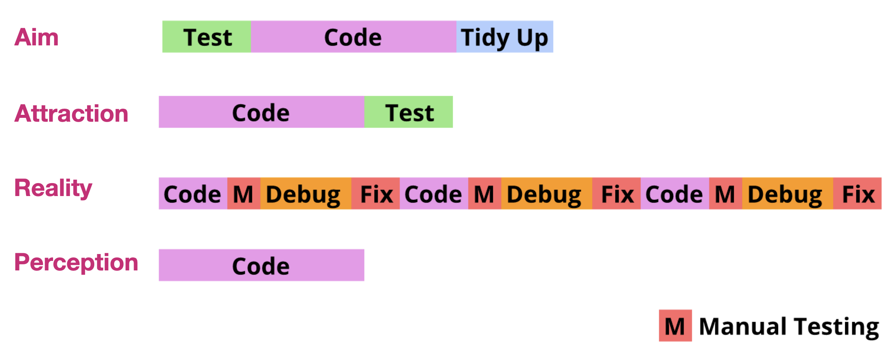
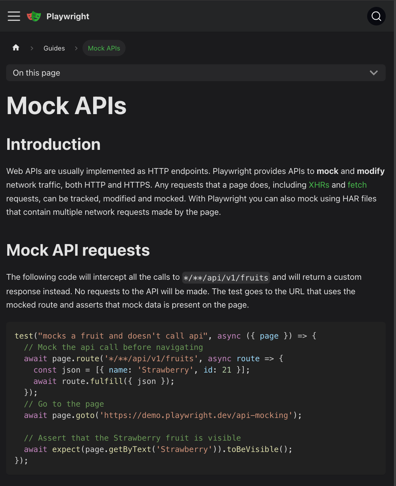

---
author:
author-twitter:
author-company:
event: Snowcamp
city: Grenoble
date: 23 janvier 2025
---

# Tester c'est tricher

## blank black
> @00:00:00@
> #JP# Dis voir Antoine, tu devrais peut-être leur expliquer pourquoi tu te trimbales avec un parapluie alors qu'il ne pleut pas ici.
> #AC# Tu sais, on n'est jamais trop prudent, imagine il pleut et bien tu ferais pas le malin.
> #JP# T'as pensé à porter un K-way dessous, histoire d'être sur ?
> #AC# Malin j'y avais pas trop pensé...
> Bon aller, on est pas là pour ça.

## poster main
Tester c'est tricher
==========
Antoine Caron _Engineering Manager @Scaleway_ !
xxxxxxxxxx
xxxxxxxxxx
xxxx
xxxxxxxxxx
xxxxxxxx
==========
xxxxxxxxxx
xxxxxx
------
Jules Poissonnet _Frontend Dev @Bedrock&nbsp;Streaming_
xxxxxxxxxx
xxxxxxxxxx
==========
xxxxxxxxxx

xxxxxxxxxx
xxxxxxxxx
==========
> #AC# Bonjour à toutes et tous, j'espère que vous allez bien et que cette journée se déroule comme vous l'espériez.
> Je m'appelle Antoine Caron et je suis Engineering manager Frontend chez Scaleway, vous m'avez peut-être vu l'année passée vous parler de Gzip.
> #JP# Et moi c'est Jules Poissonnet, Frontend Dev chez Bedrock Streaming.
> Si l'autre malin et moi-même sommes ici aujourd'hui, c'est pour vous parler de tests.
> C'est un sujet qui nous intéresse beaucoup et qu'on trouve souvent mal abordé.
> #AC# On espère avec cette présentation ouvrir un peu vos chakras sur la notion de testing.

## poster fade-from main
Tester c'est tricher
==========
Antoine Caron _Engineering Manager @Scaleway_ !
xxxxxxxxxx
xxxxxxxxxx
xxxx
xxxxxxxxxx
xxxxxxxx
==========
xxxxxxxxxx
xxxxxx
------
Jules Poissonnet _Frontend Dev @Bedrock&nbsp;Streaming_
xxxxxxxxxx
xxxxxxxxxx
==========
xxxxxxxxxx

xxxxxxxxxx
xxxxxxxxx
==========

> Souvent abordé de manière dogmatique, on va essayer une approche plus pragmatique
> #JP# Que vous fassiez du frontend, du backend, du mobile ou de l'embarqué, des "tests" ou pas, on souhaite vous proposer quelques réfléxions / conseils et approches qui pourraient être utiles et concrètes.
> #AC# Alors pourquoi "Tester c'est tricher", tricher c'est enfreindre des règles établies, des conventions, des normes.
> Pour nous, il existe des normes, des stratégies de tests qui sont souvent mal comprises, mal appliquées, mal interprétées.
> Certain penseront, qu'à l'image d'un parapluie qui nous protègent de la pluie, les tests ne servent à qu'à nous protéger des bugs et des regressions. On verra ensemble qu'une stratégie de tests ne se limite pas qu'à ce simple besoin.

## blank white 
> @00:01:30@ ±00:45
> #JP# ...Bon, prenons un objet du quotidien pour voir comment on le testerait...
> ...ton parapluie tiens ! Au moins il servira.

## media fade-from contain


> #AC# Super idée, j'adore les parapluies, c'est tellement pratique.
> Mais attends, on est dev front, j'ai aucune idée des techno de test de parapluie.
> #JP# La première chose que tu te demandes c'est "Quelles sont les techno ?"
> Perso, je préfère me demander... _Comment on teste un parapluie_

## text fade-from
🤔 Comment on teste un parapluie ? 
> #AC# C'est pas bête ça, on pourrait même se poser la question de ... _Qu'est-ce qu'on teste ?_

## text
Qu'est-ce qu'on teste ?
> #AC# Déjà, il nous faut une matière imperméable, sinon c'est pas très utile.

## media fade-from contain


> #JP# Il nous faut un procédé qui nous permet de tester unitairement la toile du parapluie.
> #AC# Ah oui je vois où tu veux en venir, un genre de test unitaire où on s'occupe uniquement de la toile.
> Ça nous permettrait d'éviter de fabriquer un parapluie qui nous protège pas du tout de la pluie.

## text white
<strong>Test unitaire</strong> de la toile
> #JP# Clairement ce serait déjà bien, mais toi comme moi, on sait que le principal souci des parapluies...
> #AC# C'est que le mécanisme est souvent fragile et fini par casser, le rendant inutilisable.
> Il nous faudrait un procédé pour tester la robustesse du mécanisme.

## media fade-from contain


> Il faudrait qu'on puisse ouvrir et fermer le mécanisme un grand nombre de fois pour s'assurer qu'il ne casse pas.
> #JP# Un peu comme un test d'intégration, on vérifie qu'un ensemble des pièces fonctionnent bien ensemble.

## text white
<strong>Test d'intégration</strong> du mécanisme
> #JP# Oui complètement, ce serait déjà pas mal, mais on sait tous que le vent est l'ennemi numéro 1 des parapluies.
> #AC# Mais comment on fait pour tester ça ? On va pas arrêter la production tant qu'il n'y a pas de vent.
> #JP# On peut surement faire passer les parapluies en soufflerie, pour s'assurer qu'ils tiennent le coup.
> #AC# Ah oui, la soufflerie, ce serait comme un test avec des mocks.

## text white
On <strong>mock</strong> le vent avec la soufflerie
> #JP# Tout ça, ça nous donne un parapluie hydrophobe, robuste et résistant au vent.
> Mais ça nous assure toujours pas qu'on est à l'abri de la pluie.
> #AC# En effet, en testant morceaux par morceaux notre parapluie, on n'est pas à l'abri de ne pas l'être.

## media fade-from logo
<iframe src="https://giphy.com/embed/BmQPKjwhScjdK" frameBorder="0" allowFullScreen></iframe>
> #AC# Pour ça, il nous faudrait un test end-to-end, un test qui nous assure que le parapluie remplit bien sa fonction première.
> On pourrait simuler de la pluie pour vérifier que le parapluie nous protège bien.

## text white
De <strong>bout en bout (e2e)</strong> l'usage du parapluie
> #JP# Ok, maintenant on est encore plus sûr que notre parapluie est de qualité.
> #AC# On pourrait envoyer des nouveaux modèles de parapluie pour voir si on a des retours positifs / négatifs.

## text white
Du <strong>canary testing</strong> sur les nouveaux modèles
> _#JP#_ Yes, on appelle en général ça du canary testing, on envoie un petit groupe de personnes pour tester un nouveau produit.

## text
🤔
> @00:04:30@ ±01:00
> #AC# Normalement vous devriez vous demander "Pourquoi ces deux là me parlent de parapluie ?"
> On a voulu vous montrer que les tests, c'est pas juste une question de techno, c'est aussi une réflexion et une stratégie.
> Par cette parabole....douteuse... on vous a partagé quelques définitions sur des procédés de tests qui répondent à différents besoin.
> Les définitions de tests unitaires, d'intégration et d'end-to-end, de mock varient beaucoup de techno en techno, de personne en personne, de projet en projet.
> On ne cherche pas ici à donner des définitions universelles, on se met juste d'accord sur ce qu'on entend par ces termes et sur les besoins auxquels ils répondent.
> Clairement, si vous les appelez autrement, il n'y a pas de soucis.
> Maintenant qu'on a fait les zozo avec nos parapluie, quelle stratégie de test on peut appliquer à nos projets, dans la vrai vie. ?

## text
Quelle <strong>stratégie</strong> alors pour mes tests ?
> #AC# Quand on vous parle de conception / structuration des tests, vous avez certainement un modèle en tête.
> Vous avez probablement entendu parlé de la pyramide des tests.
> C'est le modèle le plus connu, mais le connaissez-vous vraiment ?

## text white
La pyramide des tests
> #AC# La pyramide des tests dans votre tête c'est quoi ?
> Quand on a fouillé avec Jules, on a trouvé énormément de représentation de celle-ci et vous aller voir c'est assez surprenant.
> Aller, soirée diapositives, voici donc 3 exemples trouvés sur internet.

## ext-content

Pyramide des tests modèle 1

> #AC# Bel arc en ciel n'est-ce pas ? 
> On voit une notion de vitesse et peut-être de scope.

## ext-content

Pyramide des tests modèle 2

> #AC# Ici on voit des "solutions tests", qui ne sont pas définies dans l'article connexe.
> Pourquoi pas des "Problem tests" ?

## ext-content white

Pyramide des tests modèle 3 / ?

> #AC# Celle-là je l'aime bien, elle a le bon goût du fait maison.
> Ici E2E pour end-to-end
> #JP# Bon on pourrait jouer des heures à vous montrer des pyramides, mais on va pas le faire.
> 3 étages, parfois 2 étages, plusieurs dimensions, clairement le modèle est fortement interpreté.
> Alors sur quoi pouvons-nous nous baser pour le modèle de la pyramide des tests ?

## text white
Mais en vrai ça vient d'où ?
> #AC# Le réflexe qu'on devrait avoir ce serait de savoir d'où ça vient au départ.
> Je suis assez dérangé de toutes les interprétations qu'on peut voir.
> J'ai le sentiment que tout le monde réinterprete un modèle sans avoir fait l'effort d'aller chercher la source.
> Ou même sans dire que c'est une variante du modèle initiale.
> Et même...

## text white
Mais en vrai ça vient <strong>de qui</strong> ?
> #AC# de qui !
> Déjà, contrairement à ce qu'on peut lire dans beaucoup d'article, non ce n'est pas Martin Fowler.

## media contain logo


> #AC# C'est Mike Cohn, dans son livre "Succeeding with Agile: Software Development using Scrum".

## ext-content


> #AC# Dans ce livre il défini un modèle en forme de pyramide pour comparer 3 typologies de tests tout en comparant leur facilité de mise en oeuvre et leur capacité à apporter du feedback rapidement. 
> Voyons ça un peu de plus près.

## ext-content contain

Pyramide des tests de <strong>Mike Cohn</strong>

> Déjà dans sa pyramide, dans le chapitre il explique qu'il place que des tests automatisés.
> Dans le modèle de base il ne compare pas les tests à la main avec des tests automatisés.
> Il place en haut de la pyramide les tests UI, il ne parle pas spécifiquement de test E2E, il parle juste de tests d'interface.
> Ensuite il place les tests de service, et enfin les tests unitaires.
> Il explique que les tests UI sont les plus couteux à mettre en place, les plus lents, les plus fragiles.
> Rappel, en 2009 jules est en CE1, et clairement pour tester de manière automatisée une interface graphique c'est pas la joie.
> On est pas loin de taper deux silex entre eux pour faire du feu.
> J'ai commencé a faire des tests automatisés en 2014, et même à cette époque là, on galérait.
> Si je vous parle de Selenium, il y a peut-être quelques frissons qui vont se propager dans la salle.

## text
Les limites de ce modèle
> Ce modèle qui connait beaucoup de dérives nous parait un peu dépassé.
> Pour plusieures raisons.
> Déjà en 2025 il est bien plus facile de setup des tests d'UI.
> Voire même aussi facile que des Test unitaires.
> Que les tests unitaires peuvent être rapide à setup mais qu'ils souffrent souvent d'overspecifying.

## text
Un modèle de <strong>2009</strong>
> #JP# On ne va pas jeter la pierre à Mike Cohn, lui même reconnait dans son livre que cette pyramide fait sens en le liant au contexte technologique.
> #AC# Pour autant on voit encore ce modèle exposé, transformé, avec plus ou moins d'étages sans pour autant qu'on se préoccupe du message initial.

## ext-content contain

https://cookbook.marmicode.io/angular/pragmatic-testing-strategy/
Designing a Pragmatic Testing Strategy - <strong>Y Jaaidi</strong>

> #AC# Pour nous, une façon de modéliser qui nous semble pertinente aujourd'hui, c'est le modèle exprimé dans un article de Younes Jaaidi avec un hexagone des tests.
> _Sur cette slide on référence son article, dont le lien est dans le qrcode en bas_
> Ce modèle règle deux parties floues de la pyramide des tests qu'on a pu voir.
> #JP# D'abord, il lève l'ambiguïté entre les tests d'intégration et les tests unitaires, en les regroupant sous le terme de tests "narrow".
> Ensuite, il déplace ces tests unitaires vers le centre de l'hexagone, pour montrer qu'ils sont au cœur de la stratégie de test.
> Mais qu'ils ne sont pas la base de tout et qu'ils ne sont pas suffisants.

## text white
🔬
> @00:14:30@ ±03:00
> #JP# Maintenant voyons un peu ce qui se passe dans le monde réel, en sortant du modèle de Mike Cohn.
> J'ai monté un institut de sondage Pipo forgé par nos biais de confirmation et quelques échanges que nous avons eus depuis plusieurs années quand on pose la question.
> Soit en meetup, en conférence, en menant des audits, en faisant des entretiens, en regardant les résultats de sondages et d'enquêtes.
> On a souvent posé la question: "Et vous, comment vous testez ?"
> Voici donc quelques typologies de réponses observées, on va essayer de sainement les critiquer au sens propre du terme.
> En essayant de montrer les limites de ces approches.

## poster fade-to main
Les believers
==========
_"Nous on ne test pas, on a pas le temps."_

==========
xxxxxxxxxx
xxxxxxxxxx
----------
xxxxxxxxxx
xxxxxxxxxx
xxxxxxxxxx
xxxxxxxxxx
xxxxxxxxxx
xxxxxx
==========
> #AC# Malheureusement la réponse qu'on entend le plus souvent.
> Nous on teste pas, celle-ci, je l'aime particulièrement.
> Souvent elle est teinté de frustration, de manque de temps, de pression, de manque de compétence, de manque de ressource, etc.
> Régulièrement je réponds pour détendre un peu "Mais du coup vous faites que du code qui marche du premier coup ?".
> #JP# Vous allez nous dire, on abuse, il y en a pas tant que ça des équipes qui ne testent pas.
> Alors pour s'y être intéressé, il y a relativement peu d'étude statistique fiable sur le sujet.
> Mais il y en a une déjà qu'on pourrait citer.
> Vous connaissez le State of JS ? 

## ext-content contain

https://stateofjs.com/en-US
State of JS 2024

> C'est une étude qui est menée chaque année sur l'écosystème JS.
> Il y a un chapitre qui s'intéresse aux outils de tests voici donc quelques résultats.

## barchart unit="%" max="50"
State of JS 2024
O outil : 21 red
1 outil : 9
2 outils : 10
3 outils : 10
4 outils : 10
5+ outils : 40

> Ca, c'est ce que déclarent les répondants à l'étude.
> Déja on peut se rassurer, les équipes qui ne testent pas sont minoritaires.
> On a cependant presque un quart qui n'utilise aucun outil de test.

## poster main
Les believers
==========
_"Nous on ne test pas, on a pas le temps."_

==========
xxxxxxxxxx
xxxxxxxxxx
----------
21% n'automatisent pas leurs tests
xxxxxxxxxx
xxxxxxxxxx
xxxxxxxxxx
xxxxxx
==========
> Ne pas automatiser ses tests c'est souvent privilégier du temps humain de vérification.
> Il n'y a pas de magie, les équipes de devs vont manuellement tester lors de leur développement, les équipes produits, les équipes de tests parfois.
> #JP# C'est souvent une question de priorité, de culture, de compétence, de ressource, de maturité, etc.
> Ces approches sans automatisations peuvent paraitre de prime abord plus rapide, mais elles sont souvent plus couteuses à long terme.
> La confiance sur le code va reposer sur la mémoire humaine, la documentation, la communication.
> #AC# Clairement la stratégie du **rien** ne nous parait pas viable mis à part dans un mode draft ou on sait qu'on va jeter explicitement ce qu'on produit.
> On entend parfois des équipes qui font reposer le test manuels sur des équipe QA qui ont toute la charge de la qualité.
> C'est le modèle qu'on appelle parfois le "Ice Cream Cone" posé par **Alister B Scott**.

## ext-content contain

https://alisterscott.github.io/TestingPyramids.html
Ice cream modele - <strong>Alister B Scott</strong>

> #AC# C'est souvent une stratégie de test très coûteuse, qui va ralentir le développement, qui va être source de frustration.
> On ne dit pas que d'avoir des tests manuels c'est mal hein, on va juste dire que centraliser sa stratégie de tests dessus n'est pas pour nous une bonne idée.
> Ça ne passera pas à l'échelle.
> Il y a un vrai biais de perception du temps quand on dévéloppe sans automatiser ses tests.

## ext-content contain

https://cookbook.marmicode.io/angular/pragmatic-testing-strategy#development-time-perception-bias
Development Time Perception Bias - <strong>Y Jaaidi</strong>

> #AC# Ici on voit bien qu'en implémentant pas de tests automatisés, on a une perception du temps de développement qui est faussée.
> Sans même parler TDD, on est perpétuellement couper par une phase de vérification manuelle qu'on doit répéter à chaque itération.

## poster main
Les technophiles
==========
_"On fait du Jest / Testing Library / Cypress / ..."_
xxxxxxxxxx
xxxxxxxxxx
----------
xxxxxxxxxx
xxxxxxxxxx
xxxxxxxxxx
xxxxxxxx
==========

==========
> @00:20:00@ (06:40)
> #JP# En deuxième position des réponses à la question "Comment vous testez ?" on a souvent des réponses plus techniques.
> On nous répond des technos de tests, des outils, des librairies, des frameworks.
> Comme si ces outils étaient une fin en soi. 
> Soyons clair des outils de tests c'est bien, mais savoir clairement "Qu'est-ce qu'on teste ?" est mieux.

## poster main
Les technophiles
==========
_"On fait du Jest / Testing Library / Cypress / ..."_
xxxxxxxxxx
xxxxxxxxxx
----------
Faire des tests, juste pour en faire
xxxxxxxxxx
xxxxxxxx
==========

==========
> #JP# On a régulièrement cette réponse quand la stratégie de test semble imposée de manière très solutionniste.
> On fait des tests parce qu'on nous a dit d'en faire / qu'on nous a dit que c'était bien.
> Est-ce que ces outils, ces librairies vous aident ou au contraire vous infliges de l'aide.
> Clairement vous ici dans la salle, si vous regardez vos tests, à quoi vous sont ils utiles ?
> Qu'est-ce qu'ils vous apportent au jour le jour ?
> On observe alors de ces équipes des tests très liés au code source, ou bien des tests de très mauvaise qualité.
> Quelques exemples:

## code
```gherkin

Feature: 404 page
  
  Scenario: 404 page
    When I access access to an non existing page
    Then I should not see the homepage
    And I should not see the homepage image
    And I should not see my article description
```
> Vous avez surement rencontré des tests qui testent rien ? des tests qui font des non observations par exemple.
> Ici avec un test écrit en Gherkin, qui ne vérifie rien, j'étais content de voir qu'il marchait encore quand j'ai supprimé le code de la page 404.
> Inspiré de fait rééls...

## code
```js
it('should do addition', () => {
  expect(addition(1, 1)).toBe(2)
})

it('should do addition', () => {
  expect(substract(1, 1)).toBe(0)
})
```
> Des tests mal nommés, "Aller hop je copie ce test et je modifie juste le code et on est bon."

## code
```js
it('should render', () => {
  const { container } = render(<MyComponent />)
  expect(container).toMatchSnapshot()
})
```
> Et mes préférés, les tests qui testent la librairie de test, super! 
> Le composant il pourrait afficher une page vide, un site web ou autre on sait même pas.
> Qu'est-ce qu'on regarde là ?

## blank white
> @00:22:30@ ±01:00

## poster main
Les Sceptiques
==========
_"Nous on teste absolument tout, coverage à 100%"_
xxxxxxxxxx

==========
xxxxxxxxxx
xxxxxxxxxx
xxxxxxxxx
------
xxxxxxxxxx
xxxxxxxxxx
xxxxxxxxxx
xxxxxxxxxx
xxxxxxx
==========
> #AC# En troisième position, on va retrouver des équipes qui ont une stratégie de test très quantitative.
> Pas forcément associé à des pratiques TDD, BDD, on retrouve cependant de plus en plus d'équipe qui utilisent des indicateurs de coverage de test pour objectiver leur stratégie de tests.
> On a souvent des équipes qui vont se fixer des objectifs de coverage de test, 80%, 90%, 100%.
> Le coverage c'est comptabiliser le ratio de lignes de code qui sont exécutées par vos tests.
> Ça ne vous dit pas du tout si vos tests sont bons, si ils sont pertinents, si ils sont efficaces.
> Est-ce que cependant le coverage est une bonne métrique ?
> Est-ce que chacune des lignes de votre codebase mérite d'être testée avec la même précision, la même rigeure, le même détail ?

## poster main
Les Sceptiques
==========
_"Nous on teste absolument tout, coverage à 100%"_
xxxxxxxxxx

==========
xxxxxxxxxx
xxxxxxxxxx
xxxxxxxxxx
------
Le coverage n'est pas un indicateur de qualité de tests
xxxxxxxxxx
xxxxxxx
==========
> #AC# Le coverage n'est qu'un indicateur de quantité et de ratio, il ne donne aucune indication sur la qualité des tests.
> Il est très facile de faire des tests qui couvrent 100% d'une fonction / class / module mais qui ne font aucun expect par exemple.
> Une stratégie quantitative va également vous apporter des problèmes de scalabilité de vos tests.
> On se retrouve avec énormément de tests à faire tourner ce qui va ralentir votre CI, ralentir votre développement, le délai pour avoir du feedback en sera que plus long.

## text
<i>"Je push, je te dis dans 40min si c'est bon"</i>
> #AC# Avoir beaucoup de tests ça peut devenir un enfer, attendre 40min pour avoir du feedback ça peut être très compliqué.

## poster main
Les Sceptiques
==========
_"Nous on teste absolument tout, coverage à 100%"_
xxxxxxxxxx

==========
xxxxxxxxxx
La CI qui met 2 heures.
------
Le coverage n'est pas un indicateur de qualité de tests
xxxxxxxxxx
xxxxxxx
==========
> #AC# Est-ce que run **tous** les tests **tout le temps** est une bonne idée ?
> On verra ensemble des techniques pour éviter ça.
> Est-ce que toutes les features que vous testez méritent d'être testées avec la même rigueur ?

## poster main
Les good enough
==========
_"On teste que cette partie là, le reste c'est pas important"_

==========
xxxxxxxxxx
xxxxxxxxxx
xxxxxxxxxx
xxxxxxxxxx
------
xxxxxxxxxx
xxxxxxxxxx
xxxxxxxxxx
xxxxxxx
==========
> @00:25:30@ ±01:00
> #JP# Enfin, et c'est beaucoup plus rare, on a des équipes qui vont avoir une stratégie de test avec du focus.
> Ou avec une quantité de tests très limitée.
> Est-ce critiquable ? Est-ce que c'est une bonne idée ?
> Clairement, on a souvent des équipes qui vont se concentrer sur des parties de leur codebase, souvent les plus critiques.
> On pourrait se dire que c'est une mauvaise idée, mais en fait c'est une stratégie qui peut être très pertinente.

## poster main
Les good enough
==========
_"On teste que cette partie là, le reste c'est pas important"_

==========
xxxxxxxxxx
xxxxxxxxxx
Une approche pragmatique
xxxxxxxxxx
------
xxxxxxxxxx
xxxxxxxxxx
xxxxxxx
==========

> #JP# Cette vision pragmatique, si elle repose bien sur une analyse de risque, peut être très pertinente.
> Si clairement on a peu de tests parce qu'on a la flemme où qu'on a pas le temps, c'est pas une bonne idée.
> Mais si on peut fragmenter son application, identifier les parties les plus critiques, les plus risquées, et les tester en priorité.
> _Choisir c'est aussi renoncer_, si on choisi de ne pas tester certaines parties, c'est qu'on a fait le choix de ne pas les tester.
> C'est intéressant de creuser le pourquoi.

## ext-content 

https://xkcd.com/1205/
<strong>XKCD 1205</strong>

> #JP# Automatiser des tests ça aura un certain cout, un certain temps, une certaine complexité.
> Vous connaissez peut-être ce XKCD ?
> C'est une bande dessinée qui illustre bien cette problématique.
> Passer des heures à automatiser des tests sur une feature qui n'est pas importante pour vous, le business de votre entreprise, la codebase entière.
> Est-ce toujours pertinent ?

## ext-content contain

Automate Within the sprint - <strong>Mike Cohn</strong>

> #JP# Ces questions de coût et de gain sur l'automatisation on se les pose depuis longtemps.
> Avec le temps, le cout de maintenance, de run d'un test automatisé risque de dépasser son gain.
> Mike Cohn dans son livre exposait déjà son point de vue avec ce graphique.
> Pausons nous quelques secondes pour réfléchir à ce qu'on a vu.

## text
Quoi en penser ?
<br/>
<br/>
🤔
> @00:27:45@ ±00:30
> #AC# Bon, d'après ce sondage DIY il nous laisse l'impression que les dev ont pas tous en tête toutes les raisons et les bénéfices qu'on tire du fait de tester.

## media contain white


> #AC# En fait, si on dézoome et qu'on se demande **pourquoi** on teste, on compte 5 raisons de pourquoi on devrait automatiser des tests.

## kiosk
> #JP# On va vous faire participer un peu ! On va voir si on peut retrouver ensemble ces 5 motivations.
> Selon vous, quelles sont les raisons qui nous poussent à automatiser nos tests ?
> A vous de jouer !

> Rouge : Conformité
> On veut s'assurer que notre application respecte les spécifications et les contraintes, etc. 
> Bleu : Documenter
> Les tests sont une forme de documentation.
> Magenta : Reproductibilité
> Les tests permettent de reproduire des comportements. 
> Par exemple un disaster case, on a besoin de pouvoir tester
> mon code dans des conditions non triviales. _Echec de paiement_
> Jaune : Intégrité
> Ils permettent d'assurer un état stable de l'application, dans l'historique du code.
> $Observabilité$ de l'état de l'application. Feedback rapide de l'état de l'application.
> Vert : Stabilité
> **Non-regression**
> Est-ce que le diff que j'apporte répond bien à tous les tests déjà en place ? Est-ce que je casse pas quelque chose ? 

## poster main
Nos conseils
xxxxxxxxxx
xxxx
==========
Trucs et astuces
xxxxxxxxxx
xxxxxxxxxx
xxxxxxxxxx
xxxxxxxxxx
xxxxxxxx
----------
xxxxxxxxxx
xxxx
==========

==========
xxxxxxxxxx
xxxxxxxxxx
xxxxxxxxxx
xxxxxxxx
----------
xxxxxxxxxx
xxxxxxxxxx
xxxxxxxxxx
xxxxxxxxxx
==========
> @00:32:00@ ±01:00
> #JP# Pour répondre aux groupes identifiés dans le sondage, on a plusieurs conseils à vous donner.
> On rappelle qu'il n'y a pas de solution miracle pour vos cas, juste des conseils.
> Il faut aussi garder en tête qu'on est des dev front javascript, donc on va vous apporter des conseils qui sont orientés vers ce qu'on connait.

<!--
# présenter nos recos: vitest / playwright
## believer (ça prend trop de temps)
C'est plus aussi vrai qu'avant
pour les tests unitaires -> vitest **REF** de l'article de Younes
pour les tests UI -> playwright -> **DEMO** d'un test facile
en plus c'est rapide -> **DEMO** playwright overhead
-->
## text
Pour les <strong>believers</strong> 🫵

> #AC# Pour les believers, qui par _manque de temps_ ne testent pas.
> En 2025 on a deux outils qui peuvent vous aider à tester plus rapidement.
> La mise en place d'une stack de tests n'est plus si compliqué ou long.

## text
Pour les tests <strong>unitaires</strong>...

> Pour les tests unitaires...

## text
Pour les tests <strong><em>narrow</em></strong>...

> qu'on préfèrerait appeler des tests <strong>narrow</strong> ou étroits, on vous conseille de regarder du côté de Vitest.

## ext-content contain

Vitest
https://vitest.dev/

> #AC# On pense notamment à des outils comme Vitest, qui permettent de lancer des tests unitaires très rapidement.
> Pour ceux qui ont déjà entendu parler de Jest, il s'agit d'un outil qui se veut être son successeur.
> Il est rapide, simple, bien documenté. 
> Compatible avec les écosystème JS récents contrairement à Jest.
> Il en devient donc un peu son successeur.

## ext-content contain
Vitest: testing DX reimagined, <strong>Vladimir</strong>, ViteConf 2022
https://www.youtube.com/watch?v=oB553Noerlc


> #AC# Je vous recommande cette conférence de Vladimir, qui explique très bien Vitest.

## tip
<strong>Préfèrez Vitest</strong> à Jest en 2025

> #AC# Préférez donc Vitest à Jest en 2025, vous ne serez pas déçu.

## text
Pour vos tests <strong>UI</strong>...
> #AC# Pour vos tests d'UI il existe plusieurs outils maintenant sur le marché pour piloter des navigateurs.
> Vous connaissez peut-être WebdriverIo, Puppeteer, Cypress, Selenium, etc.
> Celui qu'on a décidé de vous recommander en 2025 c'est...

## tip
Adopter <strong>Playwright</strong> en 2025
> @00:33:30@ 

> #JP# Playwright
> Il a pas mal de fonctionnalités, qui peuvent couvrir la plupart de vos cas d'usages.
> Mais surtout, il est très simple à mettre en place.
> La aussi, en 2 temps 3 mouvements, vous avez un test d'UI qui tourne sur votre ordinateur mais également dans une CI.

## demo

> #JP# Si je prends un exemple, voilà un site de démo, qui a un bouton qui au clic affiche un résultat.
> J'ai un dossier dans le quel j'ai simplement fait initialisé playwright avec `pnpm create playwright`.
> Allons voir le test dans `simple.spec.js`.
> On a un test qui va sur la page, cherche un élément avec un role titre et vérifie le contenu.
> On voit qu'il n'est pas bon, on peut facilement le corriger en arrageant le titre.
> Là c'est peut-être un peu léger, on pourrait décider de rajouter un test qui clic sur notre bouton.
> Créeons un nouveau fichier `button.spec.js` qui: va sur la page, clic sur le bouton et vérifie le contenu.

## text
⏱ 650ms
> #JP# Mon test ne fait que cliquer sur un bouton... c'est un peu long non ?
> Il faut imaginer que devant un test unitaire, c'est à peu près 10 fois plus...
> Bon, bah c'est pas génial comme nouvelle, peut être qu'on peut se demander... _qu'est ce qui est long ?_

## text
Qu est-ce qui est long ? 🐢
> #JP#... peut être que vous avez des idées... mais j'aime bien expérimenter pour être sur.
> Alors j'ai fait en sorte que le delai de l'API que j'appelle soit paramétrable.
> Comme ça je peux mesurer la différence entre la réponse de l'API et le temps total du test.
> Ca me donne une idée de l'overhead de mon test.

## stackedchart unit="ms" 
Temps des tests
664ms : 200,#4285f4;464,#34a853;
> #JP# En paramétrant l'API à 200ms, on voit que le test prend 295ms.


## stackedchart unit="ms" 
Temps des tests
503ms : 400,#4285f4;103,#34a853;
913ms : 800,#4285f4;133,#34a853;
1716ms : 1600,#4285f4;116,#34a853;

## text
Comment y remédier ?

## tip
<strong>Mockez</strong> les APIs de vos tests UI

## ext-content contain

https://playwright.dev/docs/mock
Playwright - <strong>Mocking</strong>

> Montre API mock Playright


## blank white
> @00:38:30@ ±01:00
> Bon... maintenant quels conseils pour les technophiles !

## text
Pour les <strong>technophiles</strong> 🫵

> #AC# Essayez une approche plus à proximité du métiers de vos applications / outils.
> Pensez d'abord à vos it de tests plutot qu'à comment les implémenter.
> Vous avez des tests en place, c'est super cool mais essayons d'en améliorer la qualité et d'éloigner un peu leur implémentation du code source
> C'est souvent l'aspect de documentation présenter plus haut qui peut vous manquer.

## tip
Essayer le <strong>BDD</strong> ou l'<strong>ATDD</strong>

> Essayer de décrire par vos tests, le comportement de votre application, behavior driven development, ou acceptance test driven development.
> Des outils comme Gherkin, Cucumber, Specflow, etc. peuvent vous aider à écrire des tests plus lisibles, plus compréhensibles, plus maintenables.

## code
```gherkin
Feature: Blog Homepage
  
  Scenario: Should display 3 articles
    Given the user is on the blog homepage
    Then the user should see 3 articles
    When the user clicks on the first article
    Then the user should be redirected to the article page
```
> Dans cet exemple-ci on voit qu'on décrit juste le métier et chaque ligne appelée Step Definition va être implémentée dans un test.
> En gros, c'est un fichier test avec un language naturel qui pilote le test.
> Cela force à décrire le métier.
> L'ensemble de vos fichier Gherkin vont devenir une documentation vivante de votre application.

## ext-content contain

https://cucumber.io/
Cucumber

> Jeter donc un oeil à Cucumber, qui remplira très bien cette fonction pour vous.
> Bon pour les technophiles, on a un autre conseil pour vous.

## tip
Soignez votre <strong><em>testbase</em></strong> comme votre codebase

> Et oui, clairement les techno c'est bien, bien s'en servir c'est mieux.

## ext-content

<h3 style="width:100%">"How you do anything is how you do everything" - Le méchant dans <strong>John Wick 4</strong></h3>

> #AC# Si vous aimez vos outils et votre code, alors donner autant d'amour à votre testbase.
> Tout d'abord par souci de cohérence, mais surtout parce que quand on y réfléchit un peu, on devrait avoir des contraintes, des règles similaires.
> À savoir, le code des tests doit être lu, compris, maintenu dans le temps.
> #AC# Si on ne se fixe pas de règle, on peut vite se retrouver avec des tests qui se ressemblent, qui se dupliquent.
> Sachez que dans Eslint, l'outil de lint en JS le plus connu, il en existe des tas.

## ext-content contain

Le readme dans le repo <strong>eslint-plugin-vitest</strong>

> #AC# Ma préférée étant la règle `expect-expect` de eslint-plugin-vitest.
> Qui vérifie que pour chaque test, on vérifie bien au moins quelque chose.
> Il existe pleins de set de règles de lint pour vos fichiers de tests qui vont vous aider à en maintenir la qualité.
> Appliquer du lint sur vos tests si ce n'est pas déjà le cas.
> #AC#: Je me rappelle avoir appliquer Gherkin-lint sur une base d'un projet, ça a été sport mais bénéfique.
> J'ai pu faire le ménage de plein de tests qui testaient rien ou étaient mal écrits.

## blank white
> #JP# Bon et pour les sceptiques...

## text
Pour les <strong>sceptiques</strong> 🫵
> @00:40:30@ ±00:30
> #JP# Pour les sceptiques, qui testent tout, avec un $objectif de coverage$.
> Comment vous dire.... le coverage n'est pas un indicateur pertinent de la qualité de vos tests.
> C'est un indicateur quantitatif mais il peut vous donner une fausse indication de la qualité de vos tests.

## tip
N'objectivez pas le <strong>coverage</strong>

> #JP# "N'objectivez pas le coverage".
> Une mesure quantitative ne peut pas se soustraire d'une mesure qualitative si on veut garder du sens.
> Un principe intéressant pour compléter l'analyse de coverage, c'est le mutation testing.
> L'idée en deux phrases, c'est de modifier le code source et de voir si les tests vos tests détectent en échouant.

## ext-content contain

https://stryker-mutator.io/
Optez pour du <strong>mutation testing</strong>

> #JP# Si les tests passent même avec des modifications dans votre code, alors ce sont des tests ne testent pas grand chose.
> Le sujet en lui est très vaste et on aurait pu passer la conférence entière dessus. 
> On vous invite à regarder des outils comme Stryker, PIT, etc.

## ext-content

https://www.youtube.com/watch?v=297tyPsXOm8
Mutation Testing - <strong>Loïc Knuchel</strong>

> #JP# Voilà une conférence que je recommande sur le mutation testing si vous voulez creuser c'est un sujet très intéressant.
> Qui pose également quelques questions sur la performance de vos tests et le ciblage.

## tip
<strong>Ciblez</strong> vos tests
> #JP# Est-il pertinent de lancer tous vos tests à tous les coups ? 
> Si votre CI met 40min a vous donner un feedback positif ou negatif, clairement c'est dommage.
> _le test le plus rapide, c'est celui qu'on ne lance pas_.
> Si votre architecture le permet, configurez votre projet pour qu'il ne run que les tests impactés par vos changements.
> Les outils de tests, en tout cas côté javascript, comme Jest et Vitest proposent des outils pour run les tests sur votre diff git.
> Vous allez me dire "Oui mais justement je voudrais lancer tous mes tests pour voir les impacts transverses".
> Dans les fait, il est assez rare de casser une application en transersal quand on touche à une ligne de code (mais ça peut arriver).

## ext-content contain white

Le flag <strong>--changed</strong> de Vitest

> #JP# Chez vitest, on a le flag `--changed` auquel on peut passer un hash de commit pour run les tests sur les fichiers qui diffèrent depuis le HEAD.
> Utiliser ce flag dans vos CI quand vous ne modifier que des sources ou des tests.
> Et lancer tous vos tests pour certaines opérations comme des montées de version de dépendances ou sur la branch principale.

## ext-content contain white

Nx affected project graph when <strong>lib10</strong> is changed - Nx docs

> #JP# Dans un contexte _monorepo_, les outils de gestions permettent de run les tests sur les modules impactés par vos changements. 
> Ici, on a `nx affected`....
> Si on fait une modif dans le module "lib10", on va run les tests de "lib10" et des modules qui dépendent de "lib10", mais pas les autres.
> Cette option vous la retrouverez dans la plupart de ces outils.
> dans la plupart des cas vous n'avez pas besoin de run tous les tests dans votre CI.

## text
<strong>--bail</strong>
> #JP# Ce que vous voulez, c'est être prévenu au premier tests qui casse pour rapidement intervenir.
> C'est ce que fait l'option --bail que vous retrouverez dans la plupart des outils de tests.

## blank white
> Ok et pour les good enough ?

## text
Pour les <strong>good enough</strong> 🫵
> @00:42:30@ ±00:30
> #AC# Pour les good enough, qui testent que certaines parties de leur codebase, qui ont une stratégie de test très ciblée.
> Vous avez une stratégie de test, ok c'est cool ! 
> Mais est-ce qu'il est facile pour une nouvelle personne à onboarder de comprendre votre stratégie de test ?
> Etes-vous sur que votre stratégie répond bien aux 5 raisons évoquées plus tôt ?
> #AC# pour les "good enough" et même tous les autres, on vous conseille de documenter votre stratégie de test.

## tip 
<strong>Documentez</strong> votre stratégie de test
> #AC# Ok vous me direz c'est cool mais comment ?
> On vous propose un nouveau Standard.
> #JP# Vous connaissez peut-être les standard dans l'open source

## text
<strong>README</strong>.md
> #AC# Comme Readme.md pour décrire l'essentiel de votre projet

## text
<strong>CONTRIBUTING</strong>.md
> #AC# Comme CONTRIBUTING.md pour décrire comment installer votre projet from scratch et proposer une contribution
> On vous propose donc de rajouter un

## tip
Ajouter un <strong>TESTING</strong>.md
> #AC# TESTING.md

## demo
```txt
# Testing.md
```
> Définir dans un document des explications sur votre stratégie de test.
> Versionné avec votre code, évolutif et surtout lié à votre projet spécifiquement.

## text
Bon, au final...
> @00:43:50@ ±00:30
> Au final, on a vu qu'il n'y a pas de solution miracle pour vos tests ni votre stratégie de tests.
> Tout va dépendre du context que vous avez, de votre équipe, de votre projet, de votre entreprise.
> L'automatisation est un vrai plus pour vous aider à itérer mieux et plus vite.
> Mais la mise en place dépendra de votre stratégie, de vos choix.
> Si une personne porte un Kway sous son parapluie, elle n'est pas forcément folle, elle a peut-être juste une bonne raison.
> #JP# On vous invite à réfléchir à vos tests, à votre stratégie de tests, à vos outils, à vos librairies.
> Ne prenez pas les modèles de tests pour des vérités absolues, adaptez les à votre contexte.
> Gardez juste en tete les 5 raisons pour lesquelles on souhaite automatiser les tests, et vous devriez vous en sortir.

## poster main
Merci beaucoup !
==========
xxxxxxxxxx
xxxxxxxxxx
xxxxxxxxxx
xxxx
xxxxxxxxxx
xxxxxxxxxx
xxxxxxxx
==========
xxxxxxxxxx
xxxxxx
xxxxxxxxxx
xxxxxxxxxx
xxxxxxxxxx
xxxxxxxxxx
xxxxxxxxxx
xxxxx
==========
> @00:45:00@

## credits

Références :

* Dépôt de la présentation : https://github.com/jpoissonnet/talk-test/

Liens :
* state of js : https://stateofjs.com/en-US
* Alister B Scott, Ice Cream model : https://alisterscott.github.io/TestingPyramids.html

* Designing a Pragmatic Testing Strategy : https://cookbook.marmicode.io/angular/pragmatic-testing-strategy/
* Why Vitest? : https://cookbook.marmicode.io/angular/why-vitest/
Images :

* photos des parapluies : https://www.neyrat.fr/
* pyramide des tests 1 : https://thumbs.dreamstime.com/b/pyramide-de-test-avec-interface-utilisateur-tests-d-int%C3%A9gration-et-unitaires-essai-vecteur-unitaire-282317017.jpg
* pyramide des tests 2 : https://blog.atinternet.com/wp-content/uploads/2020/06/ROI-test.jpg
* pyramide des tests 3 : https://miro.medium.com/v2/resize:fit:1400/format:webp/1*IA6N133_wkTin6DMq30u0w.png
* mike cohn : https://upload.wikimedia.org/wikipedia/commons/a/ac/WEB_RES-Mike_Cohn-%C2%A9-2016-Hows_Your_Headshot-6.jpg
* image de chantier : https://unsplash.com/fr/photos/homme-en-veste-grise-et-orange-tenant-un-appareil-photo-reflex-numerique-vert-et-noir-pendant-la-journee-wq7oyx_Kx-4
* méchant de john wick : https://villains.fandom.com/wiki/Marquis_de_Gramont?file=F6iIyvDbMAAqS8A.jpg
* Nx affected graph : https://nx.dev/ci/features/affected#run-only-tasks-affected-by-a-pr

Polices :

* Yanone Kaffeesatz : https://fonts.google.com/specimen/Yanone+Kaffeesatz
* Just Another Hand : https://fonts.google.com/specimen/Just+Another+Hand
* Boogaloo : https://fonts.google.com/specimen/Boogaloo
* Interstate : https://fonts.adobe.com/fonts/interstate
* Sufler : https://www.dafontfree.io/sufler-font/
* OperatorMono : https://www.typography.com/blog/introducing-operator

Remerciements :

* Hubert Sablonnière : pour lui même et ses outils hyper pratiques pour les slides
* Jules : pour sa patience et sa persévérance malgré ses cours en parallèle
* Antoine : pour sa bienveillance à toute épreuve
