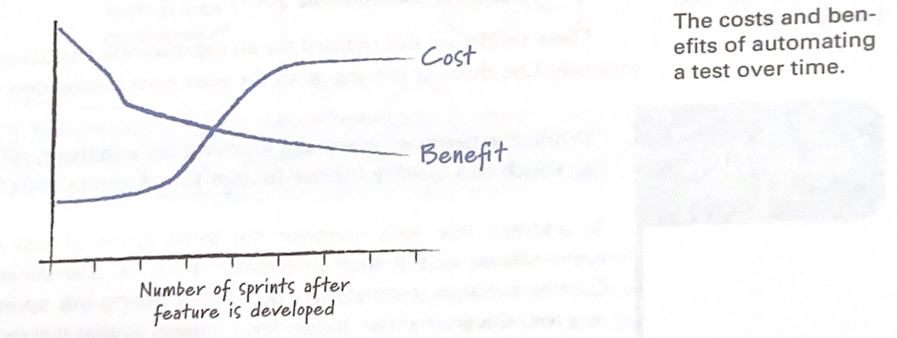
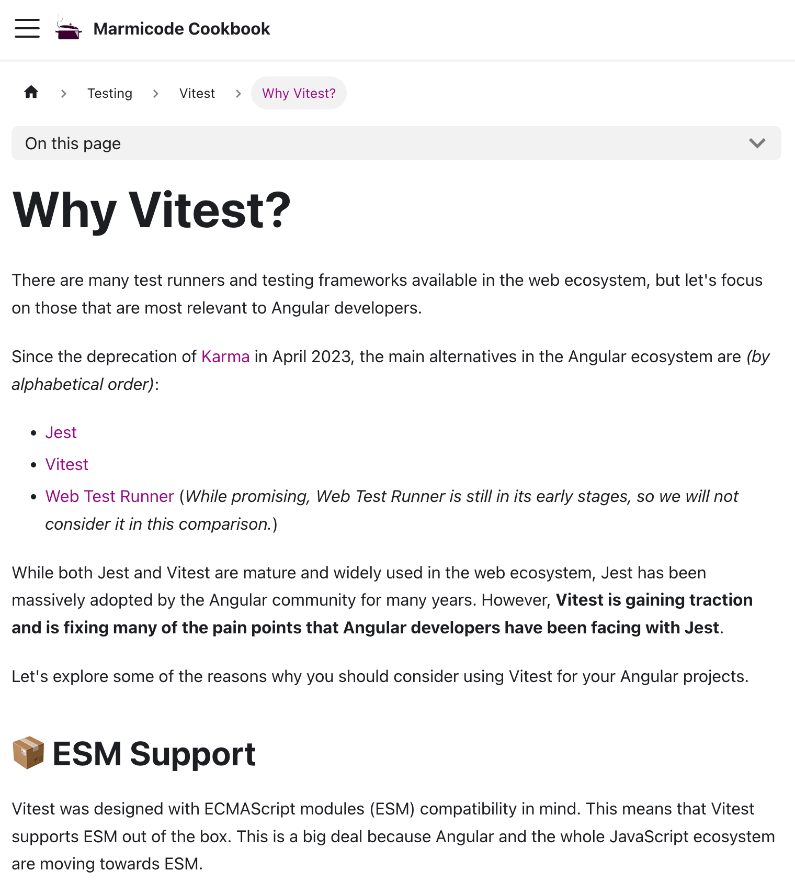
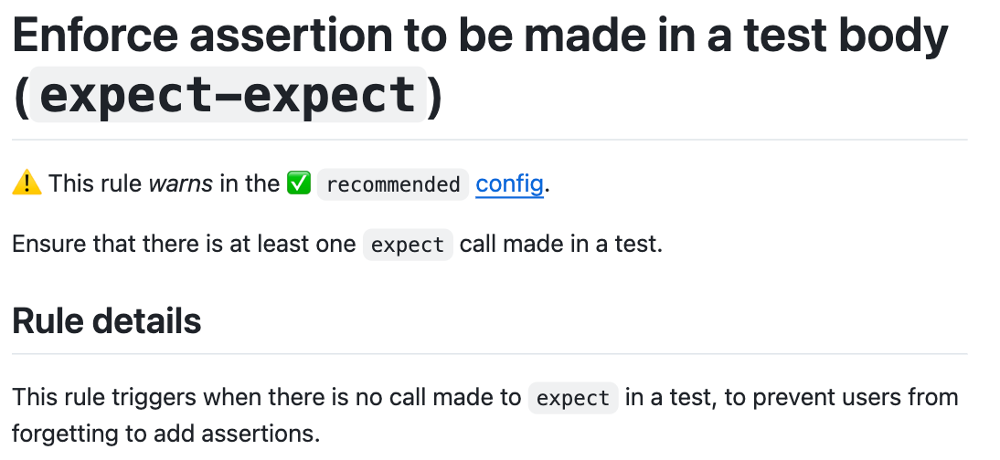
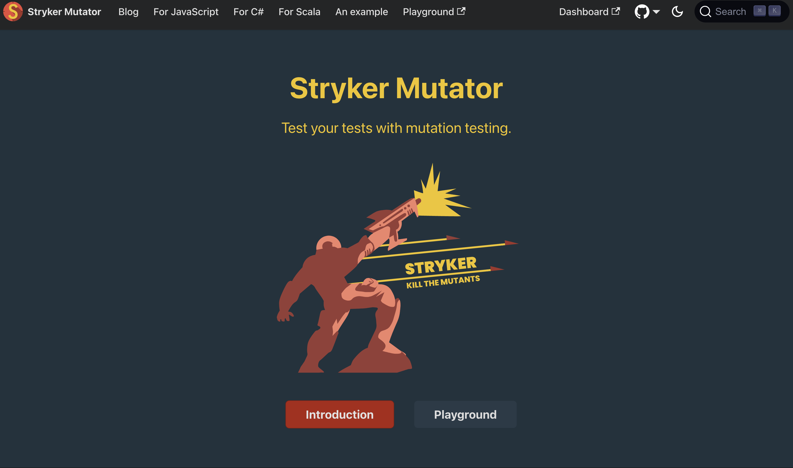
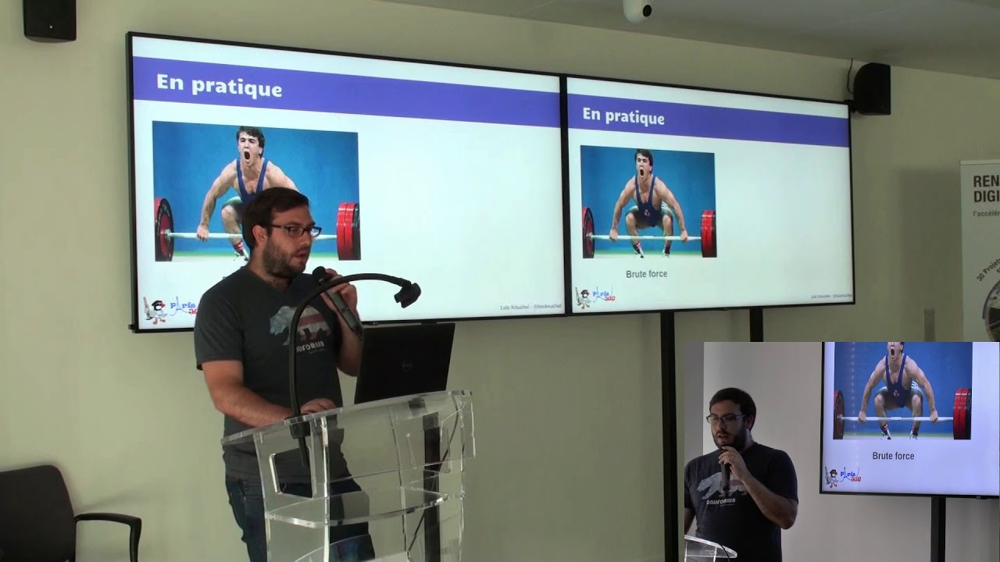
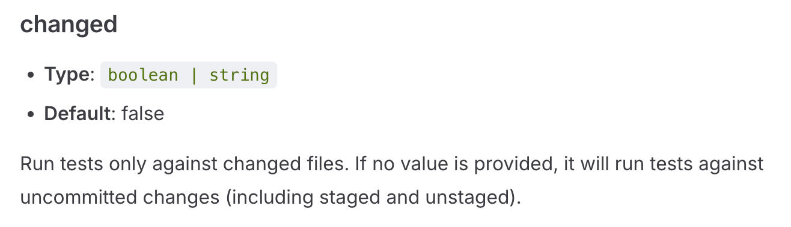
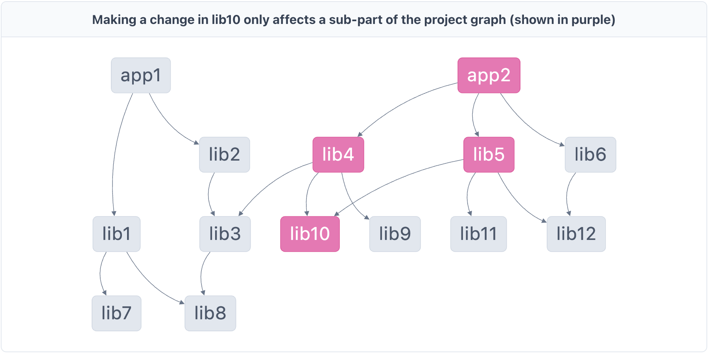

---
author:
author-twitter:
author-company:
event: Snowcamp
city: Grenoble
date: 23 janvier 2025
---

# Tester c'est tricher

## blank black
> @00:00:00@
> #JP# Dis voir Antoine, tu devrais peut-être leur expliquer pourquoi tu te trimbale avec un parapluie alors qu'il ne pleut pas ici.
> $AC$ tu sais, on est jamais trop prudent, imagine il pleut et bien tu ferais pas le malin.
> #JP# T'as pensé à porter un Kway dessous histoire d'être sur ?
> $AC$ Malin j'y avais pas trop pensé...
> Bon aller, on est pas la pour ça.

## poster fade-from main
Tester c'est tricher
==========
Antoine Caron _Engineering Manager @Scaleway_ !
xxxxxxxxxx
xxxxxxxxxx
xxxx
xxxxxxxxxx
xxxxxxxx
==========
xxxxxxxxxx
xxxxxx
------
Jules Poissonnet _Frontend Dev @Bedrock&nbsp;Streaming_
xxxxxxxxxx
xxxxxxxxxx
==========
xxxxxxxxxx

xxxxxxxxxx
xxxxxxxxx
==========
> $AC$ Bonjour à toutes et tous, j'espère que vous allez bien et que cette journée se déroule comme vous l'espériez.
> Je m'appelle Antoine Caron et je suis Engineering manager Frontend chez Scaleway, vous m'avez peut-être vu l'année passée vous parler de Gzip.
> #JP# Et moi c'est Jules Poissonnet, Frontend Dev chez Bedrock Streaming.
> Si l'autre malin avec son parapluie et moi-même sommes ici aujourd'hui, c'est pour vous parler de tests.
> C'est un sujet qui nous intéresse beaucoup et qu'on trouve souvent mal abordé.
> $AC$ On espère avec cette présentation ouvrir un peu vos chakras sur la notion de testing.
> Souvent abordé de manière dogmatique, on va essayer une approche plus pragmatique
> #JP# Que vous fassiez du frontend, du backend, du mobile ou de l'embarqué, des "tests" ou pas, on souhaite vous proposer quelques réfléxions / conseils et approches qui pourraient être utiles et concrètes.
> $AC$ Alors pourquoi "Tester c'est tricher", tricher c'est enfreindre des règles établis, des conventions, des normes.
> Pour nous il existe des normes, des stratégies de tests qui sont souvent mal comprises, mal appliquées, mal interprétées.
> #JP# On va essayer de vous montrer que les tests c'est pas juste une question de techno, c'est aussi une question de réflexion, de culture, de priorité.

## blank white 
> $AC$ ...Bon, plongeons nous dans un univers qui n'est pas le dévelopment pour voir ce qu'on peut en tirer
> Il nous faudrait un objet, par exemple.
> #JP# Un parapluie tient, au moins il sera utile.

## media fade-from contain


> $AC$ Super idée, j'adore les parapluies, c'est tellement pratique.
> Mais attends, on est dev front, j'ai aucune idée des techno de test de parapluie.
> #JP# La première chose que tu te demande c'est "Quelles sont les techno ?"
> Perso, je préfère me demander...

## text fade-from
🤔 Comment on teste un parapluie ? 
> $AC$ C'est pas bête ça, on pourrait même se poser la question de ...
> #JP# Et même aller plus loin

## text
Qu'est-ce qu'on teste ?
> $AC$ Déjà, il nous faut une matière imperméable, sinon c'est pas très utile.

## media fade-from contain


> #JP# Déjà il nous faut donc un procédé qui nous permet de tester unitairement la toile du parapluie.
> $AC$ Ah oui je vois où tu veux en venir, un genre de test unitaire où on s'occupe uniquement de la toile.
> Ça nous permettrait d'éviter de fabriquer un parapluie qui nous protège pas du tout de la pluie.

## text white
<strong>Test unitaire</strong> de la toile
> $AC$ Clairement ce serait déjà bien, mais toi comme moi, on sait que le principale souci des parapluies...
> #JP# C'est que le mécanisme est souvent fragile et fini par casser, le rendant inutilisable.
> Il nous faudrait un procédé pour tester la robustesse du mécanisme.

## media fade-from contain


> Il nous faudrait ouvrir et fermer le mécanisme un grand nombre de fois pour s'assurer qu'il ne casse pas.
> $AC$ Un peu comme un test d'intégration, on vérifie qu'un ensemble des pièces fonctionnent bien ensemble.

## text white
<strong>Test d'intégration</strong> du mécanisme
> #JP# Oui completement, ce serait déjà pas mal, mais on sait tous que le vent est l'ennemi numéro 1 des parapluies.
> $AC$ Mais comment on fait pour tester ça ? On va pas arreter la production tant qu'il n'y a pas de vent.
> #JP# On peut surement faire passer les parapluies en soufflerie, pour s'assurer qu'il tiennent le coup.
> $AC$ Ah oui, la soufflerie, ce serait comme un test avec des mocks.

## text white
On <strong>mock</strong> le vent avec la soufflerie
> #JP# Tout ça, ça nous donne un parapluie hydrophobe, robuste et résistant au vent.
> Mais ça nous assure toujours pas qu'on soit à l'abris de la pluie.
> $AC$ En effet, en testant morceaux par morceaux notre parapluie, on n'est pas à l'abris de ne pas l'être.

## media fade-from logo
<iframe src="https://giphy.com/embed/BmQPKjwhScjdK" frameBorder="0" allowFullScreen></iframe>
> $AC$ Pour ça, il nous faudrait un test end-to-end, un test qui nous assure que le parapluie remplit bien sa fonction première.
> On pourrait simuler de la pluie pour vérifier que le parapluie nous protège bien.

## text white
De <strong>bout en bout (e2e)</strong> l'usage du parapluie
> #JP# Ok, maintenant on est encore plus sûr que notre parapluie est de qualité.
> $AC$ On pourrait envoyer des nouveaux modèles de parapluie pour voir si on a des retours positifs / négatifs.

## text white
Du <strong>canary testing</strong> sur les nouveaux modèles
> _#JP#_ Yes, on appelle en général ça du canary testing, on envoie un petit groupe de personnes pour tester un nouveau produit.

## text
🤔
> $AC$ Normalement vous devriez vous demander "Pourquoi ces deux là me parlent de parapluie ?"
> #JP# C'est une très bonne question.
> $AC$ On a voulu vous montrer que les tests, c'est pas juste une question de techno, c'est aussi une question de réflexion.
> Par cette parabole....douteuse... on vous a partagé quelques définitions sur des procédés de tests qui répondent à différents besoin.
> #JP# Il est possible que les définitions qu'on vient de donner ne vous plaisent pas.
> On constate qu'il existe souvent des grandes différences entre les définitions de tests unitaires, d'intégration et d'end-to-end, de mock etc.
> $AC$ On ne cherche pas ici à donner des définitions universelles, on se met juste d'accord sur ce qu'on entend par ces termes et sur les besoins auxquels ils répondent.
> Clairement, si vous les appelez autrement, il y a pas de soucis.

## text
Quelle <strong>stratégie</strong> alors pour mes tests ?
> #JP# Maintenant qu'on a fait les zozo avec notre parapluie, quel stratégie de test on peut appliquer à nos projets ? 
> Quand on vous parle de conception / structuration des tests, vous avez certainement un modèle en tête.
> Vous avez probablement entendu parlé de la pyramide des tests.
> C'est le modèle le plus connu, mais le connaissez-vous vraiment ?

## text white
La pyramide des tests
> $AC$ La pyramide des tests dans votre tête c'est quoi ?
> Quand on a fouillé avec Jules, on a trouvé énormément de représentation de celle-ci et vous aller voir c'est assez comique.
> Aller, soirée diapositives, voici donc 3 exemples trouvés sur internet.

## ext-content

Pyramide des tests modèle 1

> $AC$ Bel arc en ciel n'est-ce pas ? 
> On voit une notion de vitesse et peut-être de scope.

## ext-content

Pyramide des tests modèle 2

> $AC$ Ici on voit des "solutions tests", qui ne sont pas définis dans l'article connexe.
> Pourquoi pas des "Problem tests" ?

## ext-content white

Pyramide des tests modèle 3 / 10000

> $AC$ Celle-là je l'aime bien, elle a le bon goût du fait maison.
> Ici E2E pour end-to-end
> #JP# Bon on pourrait jouer des heures à vous montrer des pyramides, mais on va pas le faire.
> 3 étages, parfois 2 étages, plusieurs dimensions, clairement le modèle est fortement interpreté.
> Alors sur quoi pouvons-nous nous baser pour le modele de la pyramide des tests ?

## text white
Mais en vrai ça vient d'où ?
> $AC$ Le réflexe qu'on devrait avoir ce serait de savoir d'où ça vient au départ.
> Et même...

## text white
Mais en vrai ça vient <strong>de qui</strong> ?
> $AC$ de qui !
> Déjà, contrairement à ce qu'on peut lire dans beaucoup d'article, non ce n'est pas Martin Fowler.

## media contain logo

> #JP# C'est Mike Cohn, dans son livre "Succeeding with Agile: Software Development using Scrum".

## ext-content


>  #JP# Dans ce livre il défini un modèle en forme de pyramide pour comparer 3 typologies de tests tout en comparant leur facilité de mise en oeuvre et leur capaciter à apporter du feedback rapidement. 
> Voyons ça un peu de plus près.

## ext-content contain

Pyramide des tests de <strong>Mike Cohn</strong>

> Déjà dans sa pyramide, dans le chapitre il explique qu'il place que des tests automatisés.
> Dans le modèle de base il ne compare pas les tests à la main avec des tests automatisés.
> Il place en haut de la pyramide les tests UI, il ne parle pas spécifiquement de test E2E, il parle juste de tests d'interface.
> Ensuite il place les tests de service, et enfin les tests unitaires.
> #JP# Il explique que les tests UI sont les plus couteux à mettre en place, les plus lents, les plus fragiles.
> Rappel, en 2009 je suis en CE1, et clairement pour tester de manière automatisée une interface graphique c'est pas la joie.
> On est pas loin de taper deux silex entre eux pour faire du feu.
> $AC$ J'ai commencé a faire des tests automatisés en 2014, et même à cette époque là, on galérait.
> Si je vous parle de Selenium, il y a peut-être quelques frissons qui vont se propager dans la salle.

## text
Les limites de ce modèle
> #JP# Ce modèle qui connait beaucoup de dérives nous parait un peu dépassé.
> Pour plusieurs raisons qu'on justifiera par la suite.
> $AC$ Déjà en 2025 il est bien plus facile de setup des tests d'UI.
> Voir même aussi facile que des Test unitaires.
> Que les tests unitaires peuvent être rapide à setup mais qu'ils souffrent souvent d'overspecifying.

## text
Un modèle de <strong>2009</strong>
> #JP# On ne va pas jeter la pierre à Mike Cohn, lui même reconnait dans son livre que cette pyramide fait sens notamment lié au contexte technologique.
> $AC$ Pour autant on voit encore ce modèle exposé, transformé, avec plus où moins d'étages sans pour autant qu'on se préoccupe du message initiale.

## ext-content contain

https://cookbook.marmicode.io/angular/pragmatic-testing-strategy/
Designing a Pragmatic Testing Strategy - <strong>Y Jaaidi</strong>

> $AC$ Pour nous, une façon de modéliser qui nous semble pertinente aujourd'hui, c'est le modèle exprimé dans un article de Younes Jaaidi de Marmicode avec un hexagone des tests.
> Ce modèle règle deux parties floues de la pyramide des tests qu'on a pu voir.
> #JP# D'abord, il lève l'ambiguïté entre les tests d'intégration et les tests unitaires, en les regroupant sous le terme de tests "narrow". Ensuite, il déplace ces tests unitaires vers le centre de l'hexagone, pour montrer qu'ils sont au cœur de la stratégie de test, mais qu'ils ne sont pas la base de tout et qu'ils ne sont pas suffisants.

## text white
🔬
> $AC$ Maintenant voyons un peu ce qui se passe dans le monde réel, en sortant du modèle de Mike Cohn.
> J'ai monté un institut de sondage Pipo forgé par nos biais de confirmation et quelques échanges que nous avons eu depuis plusieurs années quand on pose la question.
> Soit en meetup, en conférence, en menant des audits, on faisant des entretiens, en regardant les résultats de sondages et d'enquêtes.
> #JP# On a souvent posé la questions: "Et vous, comment vous testez ?"
> Voici donc quelques typologies de réponses observées, on va essayer de sainement les critiquer au sens propre du terme.
> En essayant de montrer les limites de ces approches.

## poster fade-to main
Les believers
==========
_"Nous on ne test pas, on a pas le temps."_

==========
xxxxxxxxxx
xxxxxxxxxx
----------
xxxxxxxxxx
xxxxxxxxxx
xxxxxxxxxx
xxxxxxxxxx
xxxxxxxxxx
xxxxxx
==========
> $AC$ Malheureusement la réponse qu'on entend le plus souvent.
> Nous on teste pas, celle-ci, je l'aime particulièrement.
> Souvent elle est teinté de frustration, de manque de temps, de pression, de manque de compétence, de manque de ressource, etc.
> Régulièrement je réponds pour détendre un peu "Mais du coup vous faites que du code qui marche du premier coup ?".
> #JP# Vous allez nous dire, on abuse, il y en a pas tant que ça des équipes qui ne testent pas.
> Alors pour s'y intéresser, il y a relativement peu d'étude statistique fiable sur le sujet.
> Mais il y en a une déjà qu'on pourrait citer.
> Vous connaissez le State of JS ? 

## ext-content contain

https://stateofjs.com/en-US
State of JS 2024

> #JP# C'est une étude qui est menée chaque année sur l'écosystème JS.
> Il y a un chapitre qui s'intéresse aux outils de tests voici donc quelques résultats.

## barchart unit="%" max="50"
State of JS 2024
O outil : 21 red
1 outil : 9
2 outils : 10
3 outils : 10
4 outils : 10
5+ outils : 40

> Voici ce que déclarent les répondants à l'étude.
> Déja on peut se rassurer, les équipes qui ne testent pas sont minoritaires.
> On a cependant presque un quart qui n'utilise aucun outil de test.

## poster main
Les believers
==========
_"Nous on ne test pas, on a pas le temps."_

==========
xxxxxxxxxx
xxxxxxxxxx
----------
21% n'automatisent pas leurs tests
xxxxxxxxxx
xxxxxxxxxx
xxxxxxxxxx
xxxxxx
==========
> Ne pas automatiser ses tests c'est souvent privéliégier du temps humain de vérification.
> Il n'y a pas de magie, les équipes de devs vont manuellement tester lors de leur développement, les équipes produits, les équipes de tests parfois.
> #JP# C'est souvent une question de priorité, de culture, de compétence, de ressource, de maturité, etc.
> Ces approches sans automatisations peuvent paraitre de prime abord plus rapide, mais elles sont souvent plus couteuses à long terme.
> La confiance sur le code va reposer sur la mémoire humaine, la documentation, la communication.
> $AC$ Clairement la stratégie du **rien** ne nous parait pas viable mis à part dans un mode draft ou on sait qu'on va jeter explicitement ce qu'on produit.
> On entend parfois des équipes qui font reposer le test manuels sur des équipe QA qui ont toute la charge de la qualité.
> C'est le modèle qu'on appelle parfois le "Ice Cream Cone" posé par **Alister B Scott**.

## ext-content contain

https://alisterscott.github.io/TestingPyramids.html
Ice cream modele - <strong>Alister B Scott</strong>

> #JP# C'est souvent une stratégie de test très coûteuse, qui va ralentir le développement, qui va être source de frustration.
> On ne dit pas que d'avoir des tests manuels c'est mal hein, on va juste dire que centraliser sa stratégie de tests dessus n'est pas pour nous une bonne idée.
> Ça ne passera pas à l'échelle.

## poster main
Les technophiles
==========
_"On fait du Jest / Testing Library / Cypress / ..."_
xxxxxxxxxx
xxxxxxxxxx
----------
xxxxxxxxxx
xxxxxxxxxx
xxxxxxxxxx
xxxxxxxx
==========

==========
> $AC$ En deuxième position des réponses à la question "Comment vous testez ?" on a souvent des réponses plus techniques.
> On nous répond des technos de tests, des outils, des librairies, des frameworks.
> Comme si ces outils étaient une fin en soi. 
> Soyons clair des outils de tests c'est bien, mais savoir clairement "Qu'est-ce qu'on teste ?" est mieux.

## poster main
Les technophiles
==========
_"On fait du Jest / Testing Library / Cypress / ..."_
xxxxxxxxxx
xxxxxxxxxx
----------
Faire des tests, juste pour en faire
xxxxxxxxxx
xxxxxxxx
==========

==========
> #JP# On a régulièrement cette réponse quand la stratégie de test semble imposée de manière très solutionniste.
> On fait des tests parce qu'on nous a dit d'en faire / qu'on nous a dit que c'était bien.
> Est-ce que ces outils, ces librairies vous aident ou au contraire vous infliges de l'aide.
> Clairement vous ici dans la salle, si vous regardez vos tests, à quoi vous sont ils utiles ?
> Qu'est-ce qu'ils vous apportent au jour le jour ?

## poster main
Les technophiles
==========
_"On fait du Jest / Testing Library / Cypress / ..."_
xxxxxxxxxx
----------
Faire des tests, juste pour en faire
xxxxxxxxxx
Qu'est-ce que vous testez ?
xxxxxxxxxx
==========

==========
> #JP# On a régulièrement cette réponse quand la stratégie de test semble imposée de manière très solutionniste.
> On fait des tests parce qu'on nous a dit d'en faire / qu'on nous a dit que c'était bien.
> Est-ce que ces outils, ces librairies vous aident ou au contraire vous infliges de l'aide.
> Clairement vous ici dans la salle, si vous regardez vos tests, à quoi vous sont ils utiles ?
> Qu'est-ce qu'ils vous apportent au jour le jour ?

## poster main
Les Sceptiques
==========
_"Nous on teste absolument tout, coverage à 100%"_
xxxxxxxxxx

==========
xxxxxxxxxx
xxxxxxxxxx
xxxxxxxxx
------
xxxxxxxxxx
xxxxxxxxxx
xxxxxxxxxx
xxxxxxxxxx
xxxxxxx
==========
> #JP# En troisième position, on va retrouver des équipes qui ont une stratégie de test très quantitative.
> Pas forcément associé à des pratiques TDD, BDD, on retrouve cependant de plus en plus d'équipe qui utilisent des indicateurs de coverage de test pour objectiver leur stratégie de tests.
> $AC$ On a souvent des équipes qui vont se fixer des objectifs de coverage de test, 80%, 90%, 100%.
> Le coverage c'est comptabiliser le ratio de lignes de code qui sont exécutées par vos tests.
> Ça ne vous dit pas du tout si vos tests sont bons, si ils sont pertinents, si ils sont efficaces.
> Est-ce que cependant le coverage est une bonne métrique ?
> Est-ce que chacune des lignes de votre codebase mérite d'être testée avec la même précision, la même rigeure, le même détail ?

## poster main
Les Sceptiques
==========
_"Nous on teste absolument tout, coverage à 100%"_
xxxxxxxxxx

==========
xxxxxxxxxx
xxxxxxxxxx
xxxxxxxxxx
------
Le coverage n'est pas un indicateur de qualité de tests
xxxxxxxxxx
xxxxxxx
==========
> #JP# Le coverage n'est qu'un indicateur de quantité et de ratio, il ne donne aucune indication sur la qualité des tests.
> Il est très facile de faire des tests qui couvrent 100% d'une fonction / class / module mais qui ne font aucun expect par exemple.
> Une stratégie quantitative va également vous apporter des problèmes de scalabilité de vos tests.
> #AC# On se retrouve avec énormément de tests à faire tourner ce qui va ralentir votre CI, ralentir votre développement, le délai pour avoir du feedback en sera que plus long.

## poster main
Les Sceptiques
==========
_"Nous on teste absolument tout, coverage à 100%"_
xxxxxxxxxx

==========
xxxxxxxxxx
La CI qui met 2 heures.
------
Le coverage n'est pas un indicateur de qualité de tests
xxxxxxxxxx
xxxxxxx
==========
> #AC# Avoir beaucoup de tests ça peut devenir un enfer, attendre 40min pour avoir du feedback ça peut être très compliqué.
> Est-ce que run **tous** les tests **tout le temps** est une bonne idée ?
> On verra ensemble des techniques pour éviter ça.

## poster main
Les good enough
==========
_"On teste que cette partie là, le reste c'est pas important"_

==========
xxxxxxxxxx
xxxxxxxxxx
xxxxxxxxxx
xxxxxxxxxx
------
xxxxxxxxxx
xxxxxxxxxx
xxxxxxxxxx
xxxxxxx
==========

> #JP# Enfin, et c'est beaucoup plus rare, on a des équipes qui vont avoir une stratégie de test avec du focus.
> Ou avec une quantité de tests très limitée.
> Est-ce critiquable ? Est-ce que c'est une bonne idée ?
> $AC$ Clairement, on a souvent des équipes qui vont se concentrer sur des parties de leur codebase, souvent les plus critiques.
> On pourrait se dire que c'est une mauvaise idée, mais en fait c'est une stratégie qui peut être très pertinente.

## poster main
Les good enough
==========
_"On teste que cette partie là, le reste c'est pas important"_

==========
xxxxxxxxxx
xxxxxxxxxx
Une approche pragmatique
xxxxxxxxxx
------
xxxxxxxxxx
xxxxxxxxxx
xxxxxxx
==========

> Cette vision pragmatique, si elle repose bien sur une analyse de risque, peut être très pertinente.
> Si clairement on a peu de tests parce qu'on a la flemme où qu'on a pas le temps, c'est pas une bonne idée.
> Mais si on peut fragmenter son application, identifier les parties les plus critiques, les plus risquées, et les tester en priorité.
> _Choisir c'est aussi renoncer_, si on choisi de ne pas tester certaines parties, c'est qu'on a fait le choix de ne pas les tester.
> C'est intéressant de creuser le pourquoi.

## ext-content 

https://xkcd.com/1205/
<strong>XKCD 1205</strong>

> #JP# Automatiser des tests ça aura un certain cout, un certain temps, une certaine complexité.
> Vous connaissez peut-être ce XKCD ?
> C'est une bande dessinée qui illustre bien cette problématique.
> Passer des heures à automatiser des tests sur une feature qui n'est pas importante pour vous, le business de votre entreprise, la codebase entière.
> Est-ce toujours pertinent ?

## ext-content contain

Automate Within the sprint - <strong>Mike Cohn</strong>

> $AC$ Ces questions de coût et de gain sur l'automatisation on se les pose depuis longtemps.
> Avec le temps, le cout de maintenance, de run d'un test automatisé risque de dépasser son gain.
> Mike Cohn dans son livre exposait déjà son point de vue avec ce graphique.
> Pausons nous quelques secondes pour réfléchir à ce qu'on a vu.

## text
Quoi en penser ?
<br/>
<br/>
🤔
> $AC$ Bon, d'après ce sondage DIY il nous laisse l'impression que les dev ont pas tous en tête toutes les raisons et les bénéfices qu'on tire du fait de tester.

## media contain white


> $AC$ En fait, si on dézoome et qu'on se demande **pourquoi** on teste, on compte 5 raisons de pourquoi on devrait automatiser des tests.

## kiosk
> #JP# On va vous faire participer un peu ! On va voir si on peut retrouver ensemble ces 5 motivations.
> Selon vous, pourquoi quelles sont les raisons qui nous poussent à automatiser nos tests ?

> Rouge : Conformité
> On veut s'assurer que notre application respecte les spécifications et les contraintes, etc. En bref, que le code, il répond bien à nos attentes.
> Que ce soit au moment du développement comme après.
> Bleu : Documenter
> Les tests sont une forme de documentation, ils laissent une trace des comportements de notre code dans différentes situations.
> Tout ce dont on veut se souvenir.
> Magenta : Reproductibilité
> Les tests permettent de reproduire des comportements, de s'assurer que le code fonctionne toujours comme prévu même dans des cas complexes.
> Reproduire un parcours utilisateur complexe, ou bien impossible. Par exemple un disaster case, on a besoin de pouvoir tester
> mon code dans des conditions non triviales. _Echec de paiement_
> Jaune : Intégrité
> Ils permettent d'assurer un état stable de l'application, dans l'historique du code, dans les branches, dans les environnements, etc.
> **Observabilité** de l'état de l'application. Feedback rapide de l'état de l'application.
> Vert : Stabilité
> **Non-regression**
> Est-ce que le diff que j'apporte répond bien à tous les tests déjà en place ? Est-ce que je casse pas quelque chose ? 
 
> $AC$ Pour nous voilà les 5 raisons qui nous poussent à écrire des tests. Il faut garder à l'esprit qu'on met en place
> tout ça pour accélerer notre développement. D'ailleurs, si vous sentez qu'un ou plusieurs de ces points sont des sujets
> dans vos projets, c'est peut-être le moment pour voir s'il n'y pas un besoin de voir ou revoir la stratégie de vos tests.
> Si vous avez des tests qui :
> - ne décrivent pas votre produit: peut etre qu'ils sont trop liés à l'implémentation
> - ne sont fait qu'a la main: et vous en écrivez par obligation
> - sont flaky: vous passez plus de temps à les réparer qu'à les écrire
> - n'apportent aucune confiance

## poster main
Nos conseils
xxxxxxxxxx
xxxx
==========
Trucs et astuces
xxxxxxxxxx
xxxxxxxxxx
xxxxxxxxxx
xxxxxxxx
xxxxxxxxxx
xxxxxxxxxx
==========
xxxxxxxxxx
xxxxxxxxx
xxxxxxxxxx
xxxxxxxxx
xxxxxxxxxx
xxxxxxx
==========
> #JP# Pour répondre aux différentes catégories de gens qu'on a vu dans le sondage, on a quelques conseils à vous donner.
> On rappelle qu'on n'est pas en mesure de vous donner des solutions miracles pour vos cas, juste des conseils.
> Il faut aussi garder en tête qu'on est des dev front javascript, donc on va vous donner des conseils qui sont orientés vers ce qu'on connait.

<!--
# présenter nos recos: vitest / playwright
## believer (ça prend trop de temps)
C'est plus aussi vrai qu'avant
pour les tests unitaires -> vitest **REF** de l'article de Younes
pour les tests UI -> playwright -> **DEMO** d'un test facile
en plus c'est rapide -> **DEMO** playwright overhead
-->
## text
Pour les <strong>believers</strong>

> $AC$ Pour les believers, qui par _manque de temps_ ne testent pas, peut-être qu'ils pourraient bénéficier de se reposer la question.
> Il faut voir dans leurs arguments quels sont les freins, si c'est à la conception qu'on ne prévoit pas le temps de tester.
> Ou bien si c'est la mise en place de la stack de tests qui semble trop longue et compliquée aux premiers abords.
> Ou encore si c'est la maintenance des tests qui semble trop lourde.
> A ceux-là, on conseillerait de se pencher sur des outils modernes qui viennent en réponse aux problèmes de lenteur et de complexité.

## text
Vitest

> #JP# On pense notamment à des outils comme Vitest, qui permettent de lancer des tests unitaires très rapidement avec une facilité déconcertante.
> Pour ceux qui ont déjà entendu parler de Jest, il s'agit d'un outil qui se veut être son successeur.
> Il est rapide, simple, bien documenté. 
> Une migration de Jest à Vitest pourrait être une bonne idée, mais pas nécessaire.
> Par contre pour tous ceux qui démarrent de rien, on déconseille de partir sur Jest plutôt que sur Vitest. 
> Ce seront des tests qui seront proche du code avec une facilité de maintenance et qui offrent un feedback rapide.

## ext-content contain

Why Vitest? - <strong>Younes "Marmicode" Jaaidi</strong>

> $AC$ On vous conseille de regarder l'article de Marmicode sur Vitest, il explique très bien pourquoi il a fait le choix de cet outil.
> Sur son blog, vous trouverez des articles très intéressants sur les tests et notamment sur la migration de Jest à Vitest.
> Il faut voir que c'est une commande pour l'installer et une commande pour l'initialiser et hop, on est prêt à tester.
> Pour les tests d'interfaces, ou un peu plus _wide_ on vous recommande...

## text
Playwright

> #JP# Playwright, c'est le petit frère de Cypress, derrière lequel se cache Microsoft.
> C'est un outil qui contrairement à Cypress, à pas un modèle économique qui veut vos sous.
> Il a beaucoup de fonctionnalités, qui peuvent couvrir la plupart de vos cas d'usages.
> Mais surtout, il est d'une simplicité déconcertante à mettre en place par rapport à ce qu'on peut penser.
> La aussi, en 2 temps 3 mouvements, vous avez un test qui tourne.

## code
```js
  test(`can fetch with 100ms delay`, async ({ page }) => {
    await page.goto(`http://localhost:3000/100`);
    const response = page.waitForResponse(/api/);
    await page.getByRole("button").click();
    await response;
    await expect(page.getByTitle("status")).toHaveText("Request successful!");
});
```
on fait un test simple

## code
```js
[0, 100, 200, 400, 800, 1600, 3200, 6400, 12800].forEach((delay) => {
    test(`can fetch with ${delay}ms delay`, async ({ page }) => {
        await page.goto(`http://localhost:3000/${delay}`);
        const response = page.waitForResponse(/api/);
        await page.getByRole("button").click();
        await response;
        await expect(page.getByTitle("status")).toHaveText("Request successful!");
    });
});
```
on montre qu'on peut le paramétrer

## demo
faire la démo de playwright overhead


<!--
## technophile (on fait du jest, du cypress...)
On teste des usages, des comportements pas des outils
Privilégier les happy path
🚚 Mettez du lint dans vos tests
BDD / ATDD
-->

## text
Pour les <strong>technophiles</strong>

> $AC$ Pour les technophiles, qui ont une stratégie de test très orientée outils, on leur conseillerait de se poser la question de ce qu'ils testent.
> La tendance dans les outils de tests reflète ce qu'on recommande à savoir tester des usages et pas des outils.
> On va recommander de tester qu'un utilisateur peut faire un clic sur votre bouton, pas que la fonction click de votre librairie est bien appelée.

## text
Happy path
> $AC$ Regardez du côté des happy path, des parcours utilisateurs les plus simples. 
> Les cas à la marge, c'est bien, mais c'est souvent là qu'on a des tests flaky, chers à maintenir.
> Et c'est pas souvent là où la valeur business est la plus grande.

## text
BDD / ATDD
expliquer que le code répond à des comportements, et ces comportements peuvent être définis par des _acceptances_.

## tip
<strong>Soigne ta <em>testbase</em></strong> comme ta codebase

## ext-content

<h3 style="width:100%">"How you do anything is how you do everything" - Le méchant dans <strong>John Wick 4</strong></h3>

> #JP# Si vous aimez vos outils et votre code, alors donner autant d'amour à votre testbase qu'à votre codebase.
> Tout d'abord par souci de cohérence, mais surtout parce que quand on y réfléchit un peu, on devrait avoir les mêmes contraintes dans une testbase que dans une codebase.
> À savoir, le code des tests doit être lu, compris, maintenu dans le temps.

## code
```js
describe('foo', () => {
  it('should do bar', () => {});
  it('should do bar', () => {}); // Has the same title as the previous test

  describe('baz', () => {
    // ...
  });
});
```

> $AC$ Si on ne se fixe pas de règle, on peut vite se retrouver avec des tests qui se ressemblent, qui se dupliquent, qui ne sont pas maintenables.
> Comme ici !
> Il existe pléthore de règles de lint pour les tests, pour les noms de tests, pour les expect, pour les describe, etc.
> Si ces règles ont été mises en place, c'est pour faire faces aux erreurs les plus courantes.
> Sachez que pour Eslint, l'outil de lint en JS le plus connu, il existe des tas.


## ext-content contain

Le readme dans le repo <strong>eslint-plugin-vitest</strong>

> $AC$ Ma préférée étant la règle `expect-expect` de eslint-plugin-vitest.
> Qui vérifie que pour chaque test, on vérifie bien au moins quelque chose ;)

<!--
## sceptique (on teste tout, coverage à 100%)
Mutation testing au lieu de coverage
> Cool pour les juniors
🚚 nx affected

## good enough (on test que ce qui est critique)
Reprendre les raisons de pourquoi on teste et voir les frictions
Et voir avec les piliers qu'on a vu si la stratégie en place est pertinente 
Vous subissez mais vous avez une stratégie

## pour tout le monde 

Avoir un testing.md
Mettre à plat, ce que vous testez, comment, comment vous répondez aux différents piliers.
Bon pour l'onboarding, pour la maintenance

**TEMPLATE** d'un fichier qui répond aux questions

# Conclusion
c'est de la triche mais on a pas de solution miracle pour vous tous
rien n'est dogmatique
à vous de cook
établissez votre stratégie

-->
> #JP# Dans les conseils qu'on peut vous donner pour concevoir une stratégie de test, voilà quelques idées et astuces qu'on peut vous donner.

## tip
N'objectivez pas le <strong>coverage</strong>

> $AC$ "N'objectivez pas le coverage". Le coverage pour rappel, c'est le ratio de ligne exécutée lors de vos tests. Ca ne mesure en rien la qualité de vos tests.

## code
```js
function add(a, b) {
  return a + b;
}

it('should add two numbers and return the result', () => {
    const firstNumber = 1;
    const secondNumber = 2;
    let result = add(firstNumber, secondNumber);
});
```
> #JP# Regarde Antoine, j'ai trouvé un code avec 100% de coverage. 
> C'est trop bien, mais là, il y a un souci évident non ?
> _solicitation du public_
> $AC$ Oui, il n'y a aucun expect. On a 100% de coverage mais on a pas de test.
> #JP# Une mesure quantitative ne peut pas se soustraire d'une mesure qualitative si on veut garder du sens. 
> Un principe intéressant pour compléter l'analyse de coverage, c'est le mutation testing. 
> L'idée en deux phrases, c'est de modifier le code source et de voir si les tests échouent.

## ext-content contain

https://stryker-mutator.io/
Optez pour du <strong>mutation testing</strong>

> #JP# Si les tests passent même avec des modifications dans votre code, alors ce sont des tests inutiles.
> $AC$ Le sujet en lui est très vaste et on aurait pu passer la conférence entière dessus. On vous invite à regarder des outils comme Stryker, PIT, etc.

## ext-content

https://www.youtube.com/watch?v=297tyPsXOm8
Mutation Testing - <strong>Loïc Knuchel</strong>

> $AC$ Voilà une conférence que je recommande sur le mutation testing si vous voulez creuser c'est un sujet très intéressant

## tip
Ciblez les tests que vos changements impacts
todo: reword 
on aura des effets de bords de temps en temps, mais le temps gagné vaut le coup de ne pas lancer toute la boucle de test à chaque fois
> #JP# On a parlé de qualité de test, parlons maintenant de la quantité.
> L'important, c'est d'avoir une feedback loop la plus courte possible.
> Un bon moyen de gagner du temps sur la CI est de réduire la quantité de test qu'on run à chaque fois.
> L'idée est de ne faire tourner que les tests du code que vous avez changé sans faire tourner le reste.
> Parce que...

## text
<i>Le test le plus rapide, c'est celui qu'on ne <strong>lance pas</strong></i>

> #JP# _le test le plus rapide, c'est celui qu'on ne lance pas_.
> Si votre architecture le permet, configurez votre projet pour qu'il ne run que les tests impactés par vos changements.
> $AC$ Les runners de tests, en tout cas côté javascript, comme Jest et Vitest proposent des outils pour run les tests sur votre diff git.

## ext-content contain white

Le flag <strong>--changed</strong> de Vitest

> $AC$ Chez vitest, on a le flag `--changed` auquel on peut passer un hash de commit pour run les tests sur les fichiers qui diffèrent depuis le HEAD. 

## ext-content contain white

Nx affected project graph when <strong>lib10</strong> is changed - Nx docs
todo: reword nx est un exemple

> #JP# Dans un contexte _monorepo_, les outils de gestions permettent de run les tests sur les modules impactés par vos changements. Ici, on a `nx affected`....
> Si on fait une modif dans le module "lib10", on va run les tests de "lib10" et des modules qui dépendent de "lib10", mais pas les autres.


## poster main
Merci beaucoup !
==========
Oubliez pas de donner du feedback !
xxxxxxxxxx
xxxxxxxxxx
xxxx
xxxxxxxxxx
xxxxxxxxxx
xxxxxxxx
==========
xxxxxxxxxx
xxxxxx
xxxxxxxxxx
xxxxxxxxxx
xxxxxxxxxx
xxxxxxxxxx
xxxxxxxxxx
xxxxx
==========

==========
> @00:45:00@

## credits

Références :

* Dépôt de la présentation : https://github.com/jpoissonnet/talk-test/

Liens :
* state of js : https://stateofjs.com/en-US
* Alister B Scott, Ice Cream model : https://alisterscott.github.io/TestingPyramids.html

* Designing a Pragmatic Testing Strategy : https://cookbook.marmicode.io/angular/pragmatic-testing-strategy/
Images :

* photos des parapluie : https://www.neyrat.fr/
* pyramide des tests 1 : https://thumbs.dreamstime.com/b/pyramide-de-test-avec-interface-utilisateur-tests-d-int%C3%A9gration-et-unitaires-essai-vecteur-unitaire-282317017.jpg
* pyramide des tests 2 : https://blog.atinternet.com/wp-content/uploads/2020/06/ROI-test.jpg
* pyramide des tests 3 : https://miro.medium.com/v2/resize:fit:1400/format:webp/1*IA6N133_wkTin6DMq30u0w.png
* mike cohn : https://upload.wikimedia.org/wikipedia/commons/a/ac/WEB_RES-Mike_Cohn-%C2%A9-2016-Hows_Your_Headshot-6.jpg
* image de chantier : https://unsplash.com/fr/photos/homme-en-veste-grise-et-orange-tenant-un-appareil-photo-reflex-numerique-vert-et-noir-pendant-la-journee-wq7oyx_Kx-4
* méchant de john wick : https://villains.fandom.com/wiki/Marquis_de_Gramont?file=F6iIyvDbMAAqS8A.jpg
* Nx affected graph : https://nx.dev/ci/features/affected#run-only-tasks-affected-by-a-pr

Polices :

* Yanone Kaffeesatz : https://fonts.google.com/specimen/Yanone+Kaffeesatz
* Just Another Hand : https://fonts.google.com/specimen/Just+Another+Hand
* Boogaloo : https://fonts.google.com/specimen/Boogaloo
* Interstate : https://fonts.adobe.com/fonts/interstate
* Sufler : https://www.dafontfree.io/sufler-font/
* OperatorMono : https://www.typography.com/blog/introducing-operator

Remerciements :

* Hubert Sablonnière : pour lui même et ses outils hyper pratiques pour les slides
* Jules : pour sa patience et sa persévérance malgré ses cours en parallèle
* Antoine : pour sa bienveillance à toute épreuve
