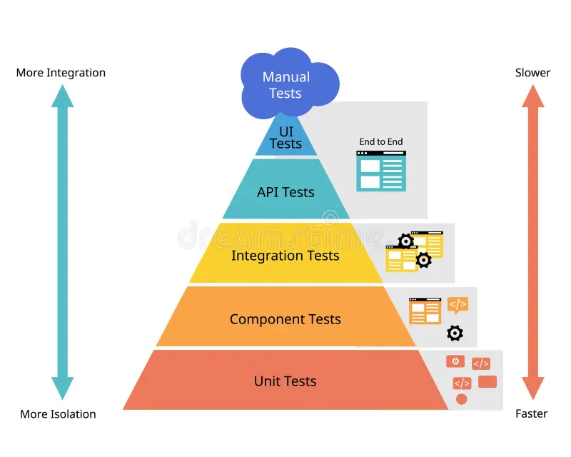
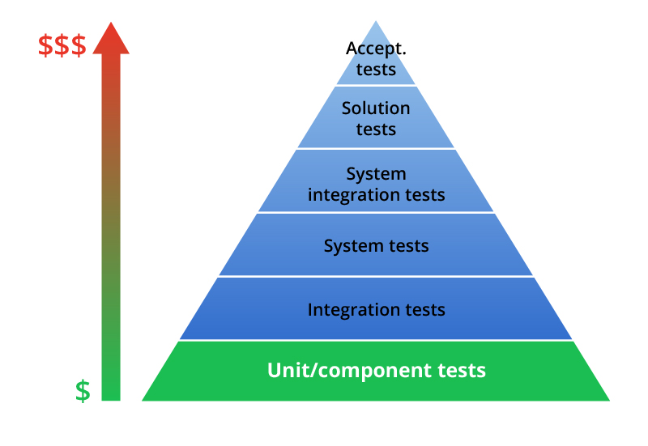
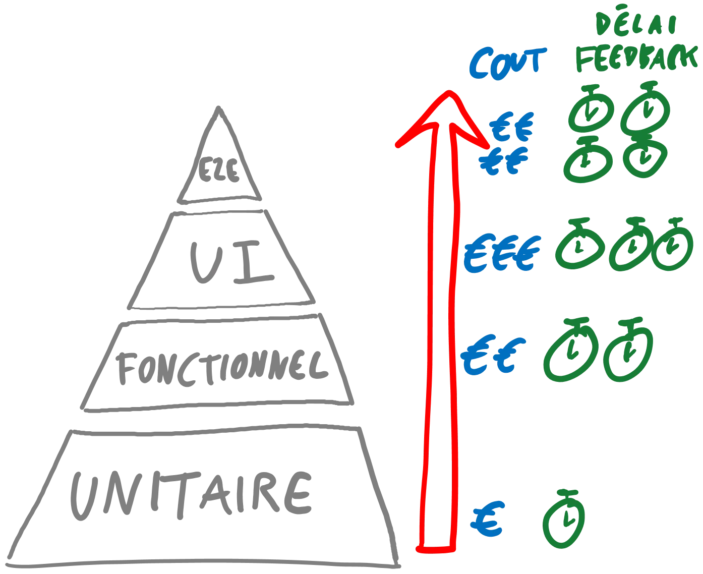
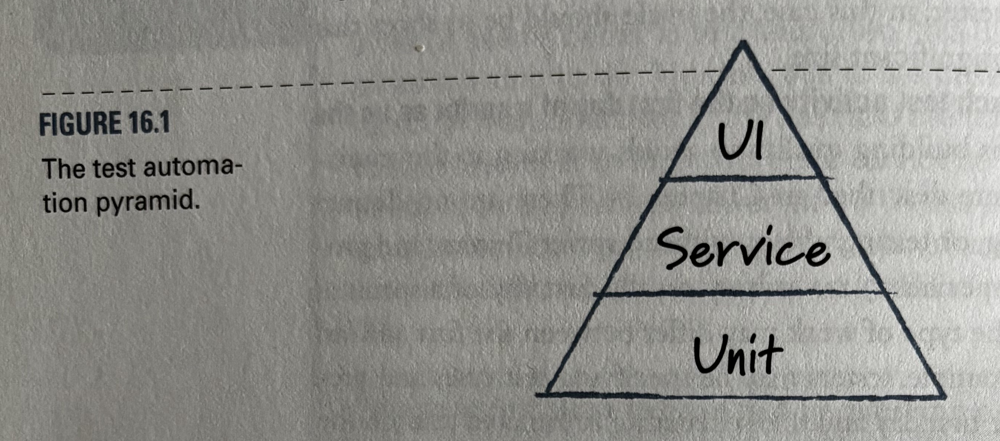
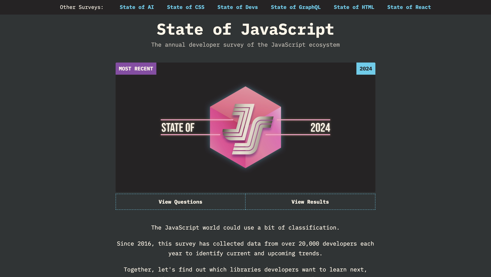
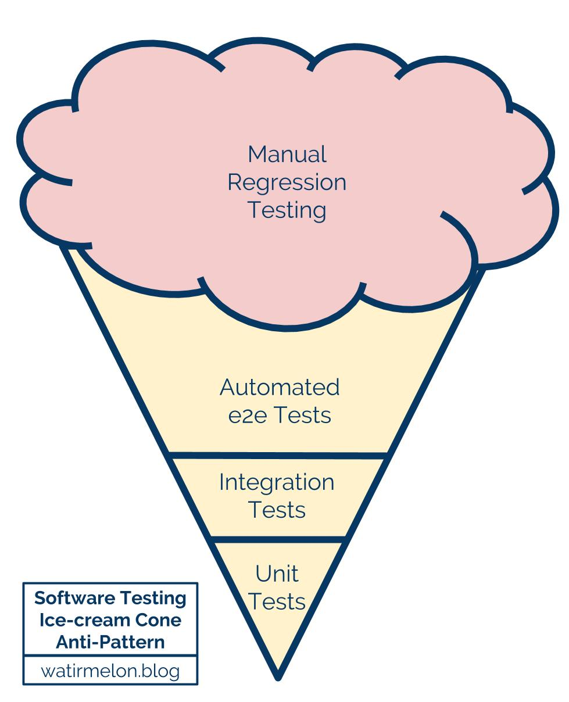

---
author:
author-twitter:
author-company:
event: Snowcamp
city: Grenoble
date: 23 janvier 2025
---

# Tester c'est tricher

## blank black
> @00:00:00@
> #JP# Dis voir Antoine, tu devrais peut-être leur expliquer pourquoi tu te trimbale avec un parapluie alors qu'il ne pleut pas ici.
> $AC$ tu sais, on est jamais trop prudent, imagine il pleut et bien tu ferais pas le malin.
> #JP# T'as pensé à porter un Kway dessous histoire d'être sur ?
> $AC$ Malin j'y avais pas trop pensé...
> Bon aller, on est pas la pour ça.

## poster fade-from main
Tester c'est tricher
==========
Antoine Caron _Engineering Manager @Scaleway_ !
xxxxxxxxxx
xxxxxxxxxx
xxxx
xxxxxxxxxx
xxxxxxxx
==========
xxxxxxxxxx
xxxxxx
------
Jules Poissonnet _Frontend Dev @Bedrock&nbsp;Streaming_
xxxxxxxxxx
xxxxxxxxxx
==========
xxxxxxxxxx

xxxxxxxxxx
xxxxxxxxx
==========
> $AC$ Bonjour à toutes et tous, j'espère que vous allez bien et que cette journée se déroule comme vous l'espériez.
> Je m'appelle Antoine Caron et je suis Engineering manager Frontend chez Scaleway, vous m'avez peut-être vu l'année passée vous parler de Gzip.
> #JP# Et moi c'est Jules Poissonnet, Frontend Dev chez Bedrock Streaming.
> Si l'autre malin avec son parapluie et moi-même sommes ici aujourd'hui, c'est pour vous parler de tests.
> C'est un sujet qui nous intéresse beaucoup et qu'on trouve souvent mal abordé.
> $AC$ On espère avec cette présentation ouvrir un peu vos chakras sur la notion de testing.
> Souvent abordé de manière dogmatique, on va essayer une approche plus pragmatique
> #JP# Que vous fassiez du frontend, du backend, du mobile ou de l'embarqué, des "tests" ou pas, on souhaite vous proposer quelques réfléxions / conseils et approches qui pourraient être utiles et concrètes.
> $AC$ Alors pourquoi "Tester c'est tricher", tricher c'est enfreindre des règles établis, des conventions, des normes.
> Pour nous il existe des normes, des stratégies de tests qui sont souvent mal comprises, mal appliquées, mal interprétées.
> #JP# On va essayer de vous montrer que les tests c'est pas juste une question de techno, c'est aussi une question de réflexion, de culture, de priorité.

## blank white 
> $AC$ ...Bon, plongeons nous dans un univers qui n'est pas le dévelopment pour voir ce qu'on peut en tirer
> Il nous faudrait un objet, par exemple.
> #JP# Un parapluie tient, au moins il sera utile.

## media fade-from contain


> $AC$ Super idée, j'adore les parapluies, c'est tellement pratique.
> Mais attends, on est dev front, j'ai aucune idée des techno de test de parapluie.
> #JP# La première chose que tu te demande c'est "Quelles sont les techno ?"
> Perso, je préfère me demander...

## text fade-from
🤔 Comment on teste un parapluie ? 
> $AC$ C'est pas bête ça, on pourrait même se poser la question de ...
> #JP# Et même aller plus loin

## text
Qu'est-ce qu'on teste ?
> $AC$ Déjà, il nous faut une matière imperméable, sinon c'est pas très utile.

## media fade-from contain


> #JP# Déjà il nous faut donc un procédé qui nous permet de tester unitairement la toile du parapluie.
> $AC$ Ah oui je vois où tu veux en venir, un genre de test unitaire où on s'occupe uniquement de la toile.
> Ça nous permettrait d'éviter de fabriquer un parapluie qui nous protège pas du tout de la pluie.

## text white
<strong>Test unitaire</strong> de la toile
> $AC$ Clairement ce serait déjà bien, mais toi comme moi, on sait que le principale souci des parapluies...
> #JP# C'est que le mécanisme est souvent fragile et fini par casser, le rendant inutilisable.
> Il nous faudrait un procédé pour tester la robustesse du mécanisme.

## media fade-from contain


> Il nous faudrait ouvrir et fermer le mécanisme un grand nombre de fois pour s'assurer qu'il ne casse pas.
> $AC$ Un peu comme un test d'intégration, on vérifie qu'un ensemble des pièces fonctionnent bien ensemble.

## text white
<strong>Test d'intégration</strong> du mécanisme
> #JP# Oui completement, ce serait déjà pas mal, mais on sait tous que le vent est l'ennemi numéro 1 des parapluies.
> $AC$ Mais comment on fait pour tester ça ? On va pas arreter la production tant qu'il n'y a pas de vent.
> #JP# On peut surement faire passer les parapluies en soufflerie, pour s'assurer qu'il tiennent le coup.
> $AC$ Ah oui, la soufflerie, ce serait comme un test avec des mocks.

## text white
On <strong>mock</strong> le vent avec la soufflerie
> #JP# Tout ça, ça nous donne un parapluie hydrophobe, robuste et résistant au vent.
> Mais ça nous assure toujours pas qu'on soit à l'abris de la pluie.
> $AC$ En effet, en testant morceaux par morceaux notre parapluie, on n'est pas à l'abris de ne pas l'être.

## media fade-from logo
<iframe src="https://giphy.com/embed/BmQPKjwhScjdK" frameBorder="0" allowFullScreen></iframe>
> $AC$ Pour ça, il nous faudrait un test end-to-end, un test qui nous assure que le parapluie remplit bien sa fonction première.
> On pourrait simuler de la pluie pour vérifier que le parapluie nous protège bien.

## text white
De <strong>bout en bout (e2e)</strong> l'usage du parapluie
> #JP# Ok, maintenant on est encore plus sûr que notre parapluie est de qualité.
> $AC$ On pourrait envoyer des nouveaux modèles de parapluie pour voir si on a des retours positifs / négatifs.

## text white
Du <strong>canary testing</strong> sur les nouveaux modèles
> _#JP#_ Yes, on appelle en général ça du canary testing, on envoie un petit groupe de personnes pour tester un nouveau produit.

## text
🤔
> $AC$ Normalement vous devriez vous demander "Pourquoi ces deux là me parlent de parapluie ?"
> #JP# C'est une très bonne question.
> $AC$ On a voulu vous montrer que les tests, c'est pas juste une question de techno, c'est aussi une question de réflexion.
> Par cette parabole....douteuse... on vous a partagé quelques définitions sur des procédés de tests qui répondent à différents besoin.
> #JP# Il est possible que les définitions qu'on vient de donner ne vous plaisent pas.
> On constate qu'il existe souvent des grandes différences entre les définitions de tests unitaires, d'intégration et d'end-to-end, de mock etc.
> $AC$ On ne cherche pas ici à donner des définitions universelles, on se met juste d'accord sur ce qu'on entend par ces termes et sur les besoins auxquels ils répondent.
> Clairement, si vous les appelez autrement, il y a pas de soucis.

## text
Quelle <strong>stratégie</strong> alors pour mes tests ?
> #JP# Maintenant qu'on a fait les zozo avec notre parapluie, quel stratégie de test on peut appliquer à nos projets ? 
> Quand on vous parle de conception / structuration des tests, vous avez certainement un modèle en tête.
> Vous avez probablement entendu parlé de la pyramide des tests.
> C'est le modèle le plus connu, mais le connaissez-vous vraiment ?

## text white
La pyramide des tests
> $AC$ La pyramide des tests dans votre tête c'est quoi ?
> Quand on a fouillé avec Jules, on a trouvé énormément de représentation de celle-ci et vous aller voir c'est assez comique.
> Aller, soirée diapositives, voici donc 3 exemples trouvés sur internet.

## media fade-from contain white


> $AC$ Bel arc en ciel n'est-ce pas ? 
> On voit une notion de vitesse et peut-être de scope.

## media fade-from contain white


> $AC$ Ici on voit des "solutions tests", qui ne sont pas définis dans l'article connexe.
> Pourquoi pas des "Problem tests" ?

## media fade-from contain white


> $AC$ Celle-là je l'aime bien, elle a le bon goût du fait maison.
> Ici E2E pour end-to-end
> #JP# Bon on pourrait jouer des heures à vous montrer des pyramides, mais on va pas le faire.
> 3 étages, parfois 2 étages, plusieurs dimensions, clairement le modèle est fortement interpreté.
> Alors sur quoi pouvons-nous nous baser pour le modele de la pyramide des tests ?

## text white
Mais en vrai ça vient d'où ?
> $AC$ Le réflexe qu'on devrait avoir ce serait de savoir d'où ça vient au départ.
> Et même...

## text white
Mais en vrai ça vient <strong>de qui</strong> ?
> $AC$ de qui !
> Déjà, contrairement à ce qu'on peut lire dans beaucoup d'article, non ce n'est pas Martin Fowler.

## media contain logo


> #JP# C'est Mike Cohn, dans son livre "Succeeding with Agile: Software Development using Scrum".

## media contain


>  #JP# Dans ce livre il défini un modèle en forme de pyramide pour comparer 3 typologies de tests tout en comparant leur facilité de mise en oeuvre et leur capaciter à apporter du feedback rapidement. 
> Voyons ça un peu de plus près.

## media fade-from contain logo


> Déjà dans sa pyramide, dans le chapitre il explique qu'il place que des tests automatisés.
> Dans le modèle de base il ne compare pas les tests à la main avec des tests automatisés.
> Il place en haut de la pyramide les tests UI, il ne parle pas spécifiquement de test E2E, il parle juste de tests d'interface.
> Ensuite il place les tests de service, et enfin les tests unitaires.
> #JP# Il explique que les tests UI sont les plus couteux à mettre en place, les plus lents, les plus fragiles.
> Rappel, en 2009 je suis en CE1, et clairement pour tester de manière automatisée une interface graphique c'est pas la joie.
> On est pas loin de taper deux silex entre eux pour faire du feu.
> $AC$ J'ai commencé a faire des tests automatisés en 2014, et même à cette époque là, on galérait.
> Si je vous parle de Selenium, il y a peut-être quelques frissons qui vont se propager dans la salle.


## text
Les limites de ce modèle
> #JP# Ce modèle qui connait beaucoup de dérives nous parait un peu dépassé.
> Pour plusieurs raisons qu'on justifiera par la suite.
> $AC$ Déjà en 2025 il est bien plus facile de setup des tests d'UI.
> Voir même aussi facile que des Test unitaires.
> Que les tests unitaires peuvent être rapide à setup mais qu'ils souffrent souvent d'overspecifying.

## text
Un modèle de <strong>2009</strong>
> #JP# On ne va pas jeter la pierre à Mike Cohn, lui même reconnait dans son livre que cette pyramide fait sens notamment lié au contexte technologique.
> $AC$ Pour autant on voit encore ce modèle exposé, transformé, avec plus où moins d'étages sans pour autant qu'on se préoccupe du message initiale.

## media contain white todo


> $AC$ Pour nous, une façon de modéliser qui nous semble pertinente aujourd'hui, c'est le modèle exprimé dans un article de Younes Jaaidi de Marmicode avec un hexagone des tests.
> Ce modèle règle deux parties floues de la pyramide des tests qu'on a pu voir.
> #JP# D'abord, il lève l'ambiguïté entre les tests d'intégration et les tests unitaires, en les regroupant sous le terme de tests "narrow". Ensuite, il déplace ces tests unitaires vers le centre de l'hexagone, pour montrer qu'ils sont au cœur de la stratégie de test, mais qu'ils ne sont pas la base de tout et qu'ils ne sont pas suffisants.

## text white
🔬
> $AC$ Maintenant voyons un peu ce qui se passe dans le monde réel, en sortant du modèle de Mike Cohn.
> J'ai monté un institut de sondage Pipo forgé par nos biais de confirmation et quelques échanges que nous avons eu depuis plusieurs années quand on pose la question.
> Soit en meetup, en conférence, en menant des audits, on faisant des entretiens, en regardant les résultats de sondages et d'enquêtes.
> #JP# On a souvent posé la questions: "Et vous, comment vous testez ?"
> Voici donc quelques typologies de réponses observées, on va essayer de sainement les critiquer au sens propre du terme.
> En essayant de montrer les limites de ces approches.

## poster fade-to
==========
_"Nous on ne test pas, on a pas le temps."_

xxxxxxxxxx
xxxxxxxxx
==========
xxxxxxxxxx
xxxxxxxxxx
----------
xxxxxxxxxx
xxxxxxxxxx
xxxxxxxxxx
xxxxxxxxxx
xxxxxxxxxx
xxxxxxxxxx
xxxxxx
==========
> $AC$ Malheureusement la réponse qu'on entend le plus souvent.
> Nous on teste pas, celle-ci, je l'aime particulièrement.
> Souvent elle est teinté de frustration, de manque de temps, de pression, de manque de compétence, de manque de ressource, etc.
> Régulièrement je réponds pour détendre un peu "Mais du coup vous faites que du code qui marche du premier coup ?".
> #JP# Vous allez nous dire, on abuse, il y en a pas tant que ça des équipes qui ne testent pas.
> Alors pour s'y intéresser, il y a relativement peu d'étude statistique fiable sur le sujet.
> Mais il y en a une déjà qu'on pourrait citer.
> Vous connaissez le State of JS ? 

## media


> #JP# C'est une étude qui est menée chaque année sur l'écosystème JS.
> Il y a un chapitre qui s'intéresse aux outils de tests voici donc quelques résultats.

## barchart unit="%" max="50"
State of JS 2024
O outil : 21 red
1 outil : 9
2 outils : 10
3 outils : 10
4 outils : 10
5+ outils : 40

> Voici ce que déclarent les répondants à l'étude.
> Déja on peut se rassurer, les équipes qui ne testent pas sont minoritaires.
> On a cependant presque un quart qui n'utilise aucun outil de test.

## poster fade-to
==========
_"Nous on ne test pas, on a pas le temps."_

xxxxxxxxxx
xxxxxxxxx
==========
xxxxxxxxxx
xxxxxxxxxx
----------
21% n'automatisent pas leurs tests
xxxxxxxxxx
xxxxxxxxxx
xxxxxxxxxx
xxxxxxxxxx
xxxxxxxxxx
xxxxxx
==========
> Ne pas automatiser ses tests c'est souvent privéliégier du temps humain de vérification.
> Il n'y a pas de magie, les équipes de devs vont manuellement tester lors de leur développement, les équipes produits, les équipes de tests parfois.
> #JP# C'est souvent une question de priorité, de culture, de compétence, de ressource, de maturité, etc.
> Ces approches sans automatisations peuvent paraitre de prime abord plus rapide, mais elles sont souvent plus couteuses à long terme.
> La confiance sur le code va reposer sur la mémoire humaine, la documentation, la communication.
> $AC$ Clairement la stratégie du **rien** ne nous parait pas viable mis à part dans un mode draft ou on sait qu'on va jeter explicitement ce qu'on produit.
> On entend parfois des équipes qui font reposer le test manuels sur des équipe QA qui ont toute la charge de la qualité.
> C'est le modèle qu'on appelle parfois le "Ice Cream Cone" posé par **Alister B Scott**.

## media contain white


> #JP# C'est souvent une stratégie de test très coûteuse, qui va ralentir le développement, qui va être source de frustration.
> On ne dit pas que d'avoir des tests manuels c'est mal hein, on va juste dire que centraliser sa stratégie de tests dessus n'est pas pour nous une bonne idée.
> Ça ne passera pas à l'échelle.

## poster fade-to
==========
_"On fait du Jest / Testing Library / Cypress / ..."_
xxxxxxxxxx
xxxxxxxxxx
----------
xxxxxxxxxx
xxxxxxxxxx
xxxxxxxxxx
xxxxxxxxxx
xxxxxxxxxx
xxxxxxxx
==========

xxxxxxxxxx
xxxxxxxxxx
==========
> $AC$ En deuxième position des réponses à la question "Comment vous testez ?" on a souvent des réponses plus techniques.
> On nous répond des technos de tests, des outils, des librairies, des frameworks.
> Comme si ces outils étaient une fin en soi. 
> Soyons clair des outils de tests c'est bien, mais savoir clairement "Qu'est-ce qu'on teste ?" est mieux.

## poster fade-to
==========
_"On fait du Jest / Testing Library / Cypress / ..."_
xxxxxxxxxx
xxxxxxxxxx
----------
Faire des tests, juste pour en faire
xxxxxxxxxx
xxxxxxxxxx
xxxxxxxxxx
xxxxxxxx
==========

xxxxxxxxxx
xxxxxxxxxx
==========
> #JP# On a régulièrement cette réponse quand la stratégie de test semble imposée de manière très solutionniste.
> On fait des tests parce qu'on nous a dit d'en faire / qu'on nous a dit que c'était bien.
> Est-ce que ces outils, ces librairies vous aident ou au contraire vous infliges de l'aide.
> Clairement vous ici dans la salle, si vous regardez vos tests, à quoi vous sont ils utiles ?
> Qu'est-ce qu'ils vous apportent au jour le jour ?

## poster fade-to
==========
_"On fait du Jest / Testing Library / Cypress / ..."_
xxxxxxxxxx
xxxxxxxxxx
----------
Faire des tests, juste pour en faire
xxxxxxxxxx
xxxxxxxxxx
xxxxxxxxxx
xxxxxxxx
==========

Qu'est-ce que vous testez ?
xxxxxxxxxx
==========
> #JP# On a régulièrement cette réponse quand la stratégie de test semble imposée de manière très solutionniste.
> On fait des tests parce qu'on nous a dit d'en faire / qu'on nous a dit que c'était bien.
> Est-ce que ces outils, ces librairies vous aident ou au contraire vous infliges de l'aide.
> Clairement vous ici dans la salle, si vous regardez vos tests, à quoi vous sont ils utiles ?
> Qu'est-ce qu'ils vous apportent au jour le jour ?

## poster fade-to
==========
_"Nous on teste absolument tout, coverage à 100%"_
xxxxxxxxxx
xxxx

xxxxxxxxxx
==========
xxxxxxxxxx
xxxxxxxxxx
xxxxxxxxx
------
xxxxxxxxxx
xxxxxxxxxx
xxxxxxxxxx
xxxxxxxxxx
xxxxxxxxxx
xxxxxxx
==========
> #JP# En troisième position, on va retrouver des équipes qui ont une stratégie de test très quantitative.
> Pas forcément associé à des pratiques TDD, BDD, on retrouve cependant de plus en plus d'équipe qui utilisent des indicateurs de coverage de test pour objectiver leur stratégie de tests.
> $AC$ On a souvent des équipes qui vont se fixer des objectifs de coverage de test, 80%, 90%, 100%.
> Le coverage c'est comptabiliser le ratio de lignes de code qui sont exécutées par vos tests.
> Ça ne vous dit pas du tout si vos tests sont bons, si ils sont pertinents, si ils sont efficaces.
> Est-ce que cependant le coverage est une bonne métrique ?
> Est-ce que chacune des lignes de votre codebase mérite d'être testée avec la même précision, la même rigeure, le même détail ?

## poster fade-to
==========
_"Nous on teste absolument tout, coverage à 100%"_
xxxxxxxxxx
xxxx

xxxxxxxxxx
==========
xxxxxxxxxx
xxxxxxxxxx
xxxxxxxxxx
------
Le coverage n'est pas un indicateur de qualité de tests
xxxxxxxxxx
xxxxxxxxxx
xxxxxxxxxx
xxxxxxx
==========
> #JP# Le coverage n'est qu'un indicateur de quantité et de ratio, il ne donne aucune indication sur la qualité des tests.
> Il est très facile de faire des tests qui couvrent 100% d'une fonction / class / module mais qui ne font aucun expect par exemple.
> Une stratégie quantitative va également vous apporter des problèmes de scalabilité de vos tests.
> #AC# On se retrouve avec énormément de tests à faire tourner ce qui va ralentir votre CI, ralentir votre développement, le délai pour avoir du feedback en sera que plus long.

## poster fade-to
==========
_"Nous on teste absolument tout, coverage à 100%"_
xxxxxxxxxx
xxxx

xxxxxxxxxx
==========
xxxxxxxxxx
xxxxxxxxxx
Trop de tests, CI trop lente
------
Le coverage n'est pas un indicateur de qualité de tests
xxxxxxxxxx
xxxxxxxxxx
xxxxxxxxxx
xxxxxxx
==========
> #AC# Avoir beaucoup de tests ça peut devenir un enfer, attendre 40min pour avoir du feedback ça peut être très compliqué.
> Est-ce que run **tous** les tests **tout le temps** est une bonne idée ?
> On verra ensemble des techniques pour éviter ça.

## poster fade-to todo
==========
_"On teste que cette partie là, le reste c'est pas important"_
xxxxxxxxxx
xxxx
xxxxxxxxxx
xxxxxxxxxx
==========
xxxxxxxxxx
xxxxxxxxxx
------
xxxxxxxxxx
xxxxxxxxxx
xxxxxxxxxx
xxxxxxx
==========

## text
Quoi en penser ?
<br/>
<br/>
🤔
> $AC$ Bon, d'après ce sondage DIY il nous laisse l'impression que les dev ont pas tous en tête toutes les raisons et les bénéfices qu'on tire du fait de tester.

## media logo white


> $AC$ En fait, si on dézoome et qu'on se demande **pourquoi** on teste, on compte 5 piliers majeurs qui nous poussent à écrire des tests.

## kiosk
> #JP# On va vous faire participer un peu ! Avec un kiosk avec 5 mots à révéler qui sont pour nous les 5 piliers du testing. On va voir si on peut retrouver ensemble les 5 piliers.
> On va essayer de prendre vos réponses et de voir si on peut les faire correspondre à nos piliers.
> Selon vous, pourquoi on teste nos applications ?

> Rouge : Conformité
> On veut s'assurer que notre application respecte les spécifications, les contraintes, les normes, les standards, les réglementations, les lois, etc. En bref, que le code, il répond bien à nos attentes.
> Bleu : Documenter
> Les tests sont une forme de documentation, ils laissent une trace des comportements de notre code dans différentes situations.
> Magenta : Reproductibilité
> Les tests permettent de reproduire des comportements, de s'assurer que le code fonctionne toujours comme prévu même dans des cas complexes.
> Jaune : Intégrité
> Ils permettent d'assurer un état stable de l'application, dans l'historique du code, dans les branches, dans les environnements, etc.  
> Vert : Stabilité
> Est-ce que le diff que j'apporte répond bien à tous les tests déjà en place ? Est-ce que je casse pas quelque chose ? 
 
> $AC$ Pour nous voilà les 5 piliers qui nous poussent à écrire des tests. Il faut garder à l'esprit qu'on met en place
> tout ça pour accélerer notre développement. D'ailleurs, si vous sentez qu'un ou plusieurs de ces piliers sont des sujets
> dans vos projets, c'est peut-être le moment pour voir s'il n'y pas un besoin de voir ou revoir la stratégie de vos tests.

## poster todo
journal section trucs et astuces

> #JP# Dans les conseils qu'on peut vous donner pour concevoir une stratégie de test, voilà quelques idées et astuces qu'on peut vous donner.

## text
Ne mesurez pas le <strong>coverage</strong>
> $AC$ "Ne mesurez pas le coverage". Le coverage pour rappel, c'est le ratio de ligne exécutée lors de vos tests. Ca ne mesure en rien la qualité de vos tests.

## code
```js
function add(a, b) {
  return a + b;
}

it('should add two numbers and return the result', () => {
    const firstNumber = 1;
    const secondNumber = 2;
    let result = add(firstNumber, secondNumber);
});
```
> #JP# Regarde Antoine, j'ai trouvé un code avec 100% de coverage. C'est trop bien, mais là, il y a un souci évident non ?
> $AC$ Oui, il n'y a aucun expect. On a 100% de coverage mais on a pas de test.
> #JP# Pour mesurer la qualité de vos tests sans coverage, on peut utiliser des outils de mutation testing.

## text todo
Optez pour du <strong>mutation testing</strong>
todo: completer l'explication
> #JP# L'idée en deux phrases, c'est de modifier le code source et de voir si les tests échouent. Si les tests qui passent même avec des modifications dans votre code sont des tests inutiles.
> $AC$ Le sujet en lui est très vaste et on aurait pu passer la conférence entière dessus. On vous invite à regarder des outils comme Stryker, PIT, etc.

## text todo
todo: ajouter un **related** sur conference du mutation testing

## text todo
Traite ta test base comme ta codebase "how you do one thing is how you do everything"
- s'imposer des règles et les automatisés (lint)
- Se reposer sur analyse statique / compilation
> Tester avec le diff avec une architecture découpé
jest / vitest le fond
nx affected
Sharding
> catégoriser et prioriser les tests
> Dans le monde JS, préférer des outils comme Vitest (référence l'article de Younes)
expliquer rapidement pourquoi
> Setup une stack E2E est facile 2025 et les tests mettent beaucoup de temps qu'à une époque Selenium
> Dans des tests d'interface web, un truc qui prend le plus de temps c'est l'http. _DEMO_ playwright overhead
> en plus ça débloque la possibilité de tester des comportement à la marge (latence / erreur)
> les tests UI ça coutent plus aussi cher qu'a l'époque, playwright est simple à setup et rapide (ce qui côute c'est ce qu'on teste)
> rationaliser sa quantité de test -> pour un freelance c'est pas nécessaire de tester parce que pas gain https://xkcd.com/1205/

## poster main
Merci beaucoup !
==========
Oubliez pas de donner du feedback !
xxxxxxxxxx
xxxxxxxxxx
xxxx
xxxxxxxxxx
xxxxxxxxxx
xxxxxxxx
==========
xxxxxxxxxx
xxxxxx
xxxxxxxxxx
xxxxxxxxxx
xxxxxxxxxx
xxxxxxxxxx
xxxxxxxxxx
xxxxx
==========

==========
> @00:45:00@

## credits

Références :

* Dépôt de la présentation : https://github.com/jpoissonnet/talk-test/

Liens :
* state of js : https://stateofjs.com/en-US
* Alister B Scott, Ice Cream model : https://alisterscott.github.io/TestingPyramids.html

* Designing a Pragmatic Testing Strategy : https://cookbook.marmicode.io/angular/pragmatic-testing-strategy/
Images :

* photos des parapluie : https://www.neyrat.fr/
* pyramide des tests 1 : https://thumbs.dreamstime.com/b/pyramide-de-test-avec-interface-utilisateur-tests-d-int%C3%A9gration-et-unitaires-essai-vecteur-unitaire-282317017.jpg
* pyramide des tests 2 : https://blog.atinternet.com/wp-content/uploads/2020/06/ROI-test.jpg
* pyramide des tests 3 : https://miro.medium.com/v2/resize:fit:1400/format:webp/1*IA6N133_wkTin6DMq30u0w.png
* mike cohn : https://upload.wikimedia.org/wikipedia/commons/a/ac/WEB_RES-Mike_Cohn-%C2%A9-2016-Hows_Your_Headshot-6.jpg
* image de chantier : https://unsplash.com/fr/photos/homme-en-veste-grise-et-orange-tenant-un-appareil-photo-reflex-numerique-vert-et-noir-pendant-la-journee-wq7oyx_Kx-4

Polices :

* Yanone Kaffeesatz : https://fonts.google.com/specimen/Yanone+Kaffeesatz
* Just Another Hand : https://fonts.google.com/specimen/Just+Another+Hand
* Boogaloo : https://fonts.google.com/specimen/Boogaloo
* Interstate : https://fonts.adobe.com/fonts/interstate
* Sufler : https://www.dafontfree.io/sufler-font/
* OperatorMono : https://www.typography.com/blog/introducing-operator

Remerciements :

* Hubert Sablonnière : pour lui même et ses outils hyper pratiques pour les slides
* Jules : pour sa patience et sa persévérance malgrés ses cours en parallèle
